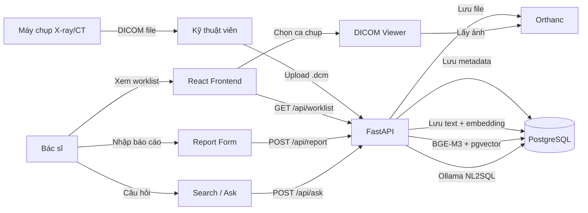
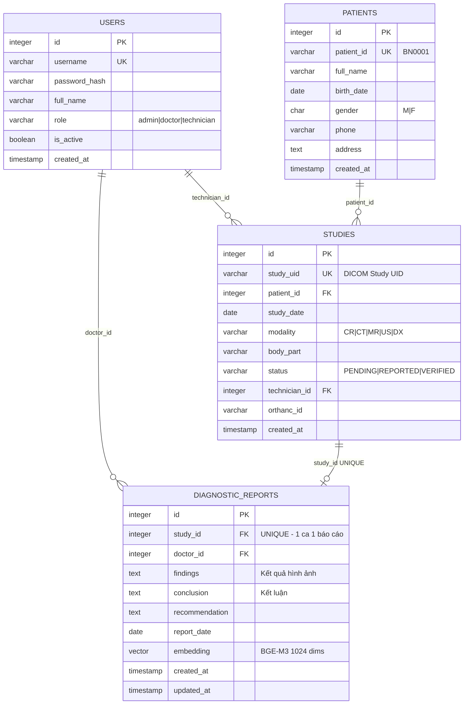
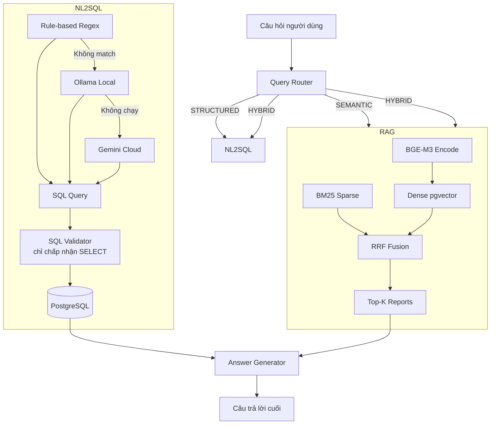
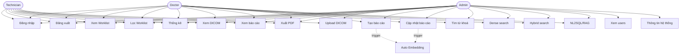
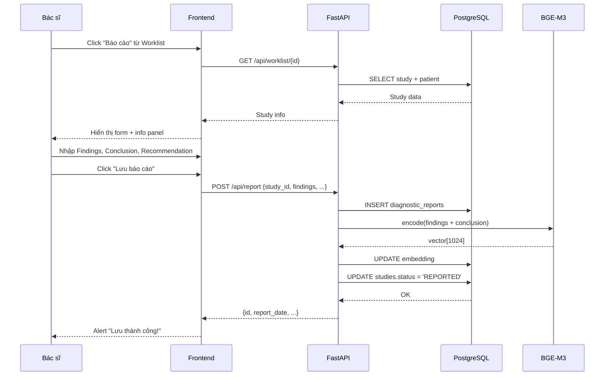

# PACS++ — Tài liệu Thiết kế Toàn diện
> **Phiên bản:** Sprint 1 Design Phase  
> **Cập nhật lần cuối:** 2026-03-28  
> **Trạng thái:** Chờ review → Bắt đầu code

---

# MỤC LỤC

1. [Tổng quan dự án](#1-tổng-quan-dự-án)
2. [Công nghệ sử dụng](#2-công-nghệ-sử-dụng)
3. [Kiến trúc hệ thống](#3-kiến-trúc-hệ-thống)
4. [ERD — Cơ sở dữ liệu](#4-erd--cơ-sở-dữ-liệu)
5. [Backend API](#5-backend-api)
6. [RAG & NL2SQL Engine](#6-rag--nl2sql-engine)
7. [Frontend Architecture](#7-frontend-architecture)
8. [Use Cases](#8-use-cases)
9. [Chức năng theo từng trang](#9-chức-năng-theo-từng-trang)
10. [Ma trận phân quyền](#10-ma-trận-phân-quyền)
11. [Sprint Roadmap](#11-sprint-roadmap)
12. [Lệnh khởi chạy](#12-lệnh-khởi-chạy)

---

# 1. Tổng quan dự án

**PACS++** là hệ thống lưu trữ và truyền tải hình ảnh y tế (PACS) tích hợp AI tìm kiếm thông minh dựa trên RAG.

**Mục tiêu:** Giúp bác sĩ và kỹ thuật viên X-quang quản lý, tra cứu kết quả chẩn đoán hình ảnh (CT, MRI, X-ray...) nhanh chóng và thông minh.

### Vai trò người dùng

| Role | Tên | Quyền chính |
|---|---|---|
| `admin` | Quản trị viên | Toàn quyền |
| `doctor` | Bác sĩ | Đọc, viết báo cáo, tìm kiếm |
| `technician` | Kỹ thuật viên | Xem worklist, upload DICOM |

---

# 2. Công nghệ sử dụng

### Backend

| Thành phần | Công nghệ | Mục đích |
|---|---|---|
| Web Framework | **FastAPI** (Python 3.12) | REST API |
| ASGI Server | **Uvicorn** | HTTP server |
| Database | **PostgreSQL 16** | Dữ liệu chính |
| Vector Extension | **pgvector** | Lưu vector 1024d |
| DICOM Server | **Orthanc** (Docker) | Lưu file DICOM |
| Embedding | **BGE-M3** (FlagEmbedding) | Text → Vector |
| LLM Local | **Ollama** (qwen2.5-coder:7b) | NL2SQL không cần cloud |
| LLM Cloud | **Gemini 2.0 Flash** | Fallback |
| Auth | **JWT** (python-jose) | Xác thực |
| PDF | **ReportLab** | Xuất báo cáo PDF |
| Container | **Docker Compose** | PostgreSQL + Orthanc |

### Frontend

| Thành phần | Công nghệ | Mục đích |
|---|---|---|
| Framework | **React 18** | SPA UI |
| Build Tool | **Vite** | Dev server + bundling |
| Routing | **React Router v6** | Client-side routing |
| CSS | **Vanilla CSS** | Custom design system |
| Font | Inter + JetBrains Mono | Typography |
| HTTP | fetch API (wrapper) | Gọi REST API |

---

# 3. Kiến trúc hệ thống

```
┌────────────────────────────────────────────────────┐
│              Docker Compose                         │
│  ┌───────────────────┐  ┌────────────────────────┐ │
│  │  PostgreSQL 16    │  │  Orthanc DICOM Server  │ │
│  │  + pgvector       │  │  Port: 8042 (HTTP)     │ │
│  │  Port: 5432       │  │  Port: 4242 (DICOM)    │ │
│  └───────────────────┘  └────────────────────────┘ │
└────────────────────────────────────────────────────┘

┌────────────────────────────────────────────────────┐
│          FastAPI Backend — Port 8000                │
│  /api/* → Router xử lý                             │
│  /assets, /  → Serve Vite build (production)       │
└────────────────────────────────────────────────────┘

┌────────────────────────────────────────────────────┐
│          Vite Dev Server — Port 5173                │
│  React SPA — proxy /api/* → localhost:8000          │
└────────────────────────────────────────────────────┘

┌────────────────────────────────────────────────────┐
│          Ollama — Port 11434                        │
│          Model: qwen2.5-coder:7b                   │
└────────────────────────────────────────────────────┘
```

### Luồng dữ liệu tổng quát



---

# 4. ERD — Cơ sở dữ liệu



### Chi tiết bảng

| Bảng | Rows mẫu | Ghi chú |
|---|---|---|
| `users` | 5 | 1 admin, 2 doctor, 2 technician |
| `patients` | 30 | Tên Việt Nam giả |
| `studies` | 44 | Đa dạng modality, status |
| `diagnostic_reports` | ~20 | Kèm vector embedding 1024d |

**Index đặc biệt:**
- `studies`: idx trên `patient_id`, `study_date`, `status`
- `diagnostic_reports`: IVFFlat index trên `embedding` với `vector_cosine_ops`

---

# 5. Backend API

### Cấu trúc thư mục

```
backend/
├── main.py              # App entry — routers, static, CORS
├── config.py            # .env reader
├── api/
│   ├── auth.py          # /api/auth/*
│   ├── worklist.py      # /api/worklist/*
│   ├── dicom.py         # /api/dicom/*
│   ├── report.py        # /api/report/*
│   ├── search.py        # /api/search/*
│   └── ask.py           # /api/ask
├── core/
│   ├── auth_utils.py    # JWT, bcrypt
│   ├── embedding_model.py # BGE-M3 singleton
│   ├── rag_engine.py    # Dense + Hybrid search
│   ├── nl2sql_engine.py # Rule-based → Ollama → Gemini
│   ├── query_router.py  # STRUCTURED/SEMANTIC/HYBRID
│   ├── answer_generator.py
│   └── orthanc_client.py
├── database/
│   ├── connection.py
│   └── schema.sql
└── scripts/
    └── seed_data.py
```

### Danh sách API Endpoints

| Method | Endpoint | Auth | Role | Chức năng |
|---|---|:---:|---|---|
| POST | `/api/auth/login` | ❌ | All | Đăng nhập → JWT |
| GET | `/api/auth/me` | ✅ | All | Thông tin user |
| GET | `/api/worklist` | ✅ | All | Danh sách ca chụp |
| GET | `/api/worklist/{id}` | ✅ | All | Chi tiết ca chụp |
| GET | `/api/worklist/stats/dashboard` | ✅ | All | Thống kê |
| POST | `/api/dicom/upload` | ✅ | tech/admin | Upload DICOM |
| GET | `/api/dicom/wado` | ✅ | All | Lấy ảnh DICOM |
| GET | `/api/report/{study_id}` | ✅ | All | Xem báo cáo |
| POST | `/api/report` | ✅ | doctor/admin | Tạo báo cáo |
| PUT | `/api/report/{id}` | ✅ | doctor/admin | Cập nhật báo cáo |
| GET | `/api/report/{id}/pdf` | ✅ | All | Xuất PDF |
| GET | `/api/search/keyword` | ✅ | doctor/admin | Tìm từ khoá |
| POST | `/api/search` | ✅ | doctor/admin | Dense/Hybrid search |
| POST | `/api/ask` | ✅ | doctor/admin | NL2SQL + RAG unified |
| GET | `/health` | ❌ | - | Health check |

---

# 6. RAG & NL2SQL Engine



### Ví dụ phân loại câu hỏi

| Câu hỏi | Intent | Phương pháp |
|---|---|---|
| "Bao nhiêu ca CT hôm nay?" | STRUCTURED | Rule-based SQL |
| "Ca nào chưa đọc?" | STRUCTURED | Rule-based SQL |
| "BN Nguyễn Văn A chụp gì?" | STRUCTURED | Ollama SQL |
| "Tổn thương nốt đơn độc phổi phải" | SEMANTIC | RAG Hybrid |
| "Viêm phổi thùy dưới tháng 3" | HYBRID | SQL + RAG |

---

# 7. Frontend Architecture

### Cấu trúc thư mục

```
frontend-react/            ← Vite project (npm create vite)
├── index.html
├── vite.config.js         ← proxy /api → :8000
├── package.json
└── src/
    ├── main.jsx           ← mount App vào #root
    ├── App.jsx            ← Router + Auth guard
    ├── styles/
    │   ├── variables.css  ← design tokens
    │   ├── base.css       ← reset, utilities, animations
    │   ├── layout.css     ← sidebar, topbar, app shell
    │   └── components.css ← button, card, table, form, badge
    ├── api/
    │   └── index.js       ← tất cả fetch, auto JWT header
    ├── hooks/
    │   └── useAuth.js     ← token, user, login/logout
    ├── components/
    │   ├── layout/
    │   │   ├── Sidebar.jsx
    │   │   ├── Topbar.jsx
    │   │   └── AppLayout.jsx
    │   └── shared/
    │       ├── StatusBadge.jsx
    │       ├── StatCard.jsx
    │       ├── DataTable.jsx
    │       └── LoadingSpinner.jsx
    └── pages/
        ├── Login.jsx
        ├── Worklist.jsx
        ├── Viewer.jsx
        ├── Report.jsx
        ├── Search.jsx
        └── Admin.jsx
```

### Component Tree

```
App (HashRouter)
├── /login → Login
│   ├── BrandingPanel
│   └── LoginForm
└── AppLayout (Protected)
    ├── Sidebar
    │   ├── Logo (PACS++)
    │   ├── NavItems (filter by role)
    │   └── UserFooter + Logout
    └── MainArea
        ├── Topbar
        └── PageContent (Outlet)
            ├── /worklist → Worklist
            │   ├── StatCards ×4
            │   ├── UploadZone (tech+admin)
            │   ├── FilterBar
            │   └── DataTable
            ├── /search → Search
            │   ├── SearchTabs
            │   ├── SearchInput
            │   ├── NL2SQLBox (tab ask)
            │   └── ResultCards
            ├── /report → Report
            │   ├── StudyInfoPanel
            │   └── ReportForm
            ├── /viewer → Viewer
            │   ├── StudyInfoPanel
            │   ├── ViewerControls
            │   └── DicomCanvas (Orthanc iframe)
            └── /admin → Admin
                ├── UserTable
                └── SystemInfoCards
```

### Design System (Hospital Dark Theme)

| Token | Giá trị | Dùng cho |
|---|---|---|
| `--bg-base` | `#09111f` | App background |
| `--bg-surface` | `#0d1829` | Cards, panels |
| `--bg-elevated` | `#132035` | Hover, elevated |
| `--accent` | `#3b82f6` | Primary, link |
| `--success` | `#22c55e` | REPORTED |
| `--warning` | `#f59e0b` | PENDING |
| `--danger` | `#ef4444` | Error |
| `--text-primary` | `#e2eaf4` | Main text |
| `--text-muted` | `#4d6a8a` | Placeholder |
| Font heading | Inter | UI text |
| Font code | JetBrains Mono | UID, code |

---

# 8. Use Cases

## Danh sách 18 Use Cases

| ID | Tên | Actor |
|---|---|---|
| UC01 | Đăng nhập | All |
| UC02 | Đăng xuất | All |
| UC03 | Xem danh sách ca chụp | All |
| UC04 | Lọc worklist | All |
| UC05 | Xem thống kê dashboard | All |
| UC06 | Upload file DICOM | Tech, Admin |
| UC07 | Xem ảnh DICOM | All |
| UC08 | Tạo báo cáo chẩn đoán | Doctor, Admin |
| UC09 | Cập nhật báo cáo | Doctor, Admin |
| UC10 | Xem báo cáo (readonly) | All |
| UC11 | Xuất PDF báo cáo | All |
| UC12 | Tìm kiếm từ khoá | Doctor, Admin |
| UC13 | Tìm kiếm ngữ nghĩa Dense | Doctor, Admin |
| UC14 | Tìm kiếm Hybrid | Doctor, Admin |
| UC15 | Hỏi đáp NL2SQL/RAG | Doctor, Admin |
| UC16 | Xem danh sách users | Admin |
| UC17 | Xem thông tin hệ thống | Admin |
| UC18 | Tự động tạo Embedding | System |

## Sơ đồ Use Case



## UC08 — Tạo báo cáo (chi tiết nhất)



---

# 9. Chức năng theo từng trang

### Login
| # | Chức năng | Role |
|---|---|---|
| 1 | Đăng nhập JWT | All |
| 2 | Lưu token localStorage | All |
| 3 | Auto-redirect nếu đã login | All |
| 4 | Hiển thị lỗi đăng nhập | All |
| 5 | Gợi ý tài khoản test | All |

### Worklist
| # | Chức năng | Role |
|---|---|---|
| 6–9 | Stat cards (Tổng/Chờ/Báo cáo/Xác nhận) | All |
| 10–13 | Upload DICOM (drag/drop, parse tags, Orthanc, DB) | Tech, Admin |
| 14–17 | Filter (date, modality, status, xoá) | All |
| 18–23 | Bảng ca chụp (click→viewer, nút, badges) | All / Role |

### Viewer
| # | Chức năng | Role |
|---|---|---|
| 24 | Metadata ca chụp | All |
| 25 | Xem ảnh DICOM (Orthanc iframe) | All |
| 26 | Thông báo chưa upload | All |
| 27–30 | Toolbar (zoom, pan, reset) | All |
| 31–32 | Điều hướng (→ Báo cáo, → Worklist) | All/Doctor |

### Report
| # | Chức năng | Role |
|---|---|---|
| 33 | Thông tin ca chụp (readonly) | All |
| 34–36 | Form nhập (Findings, Conclusion, Recommendation) | Doctor, Admin |
| 37–40 | Tạo / Cập nhật / Alert / Readonly mode | Doctor/Admin/Tech |
| 41 | Xuất PDF | All |
| 42–43 | Auto embedding + status update | System |

### Search
| # | Chức năng | Role |
|---|---|---|
| 44–45 | Keyword SQL ILIKE | Doctor, Admin |
| 46–48 | Dense BGE-M3 + score bar | Doctor, Admin |
| 47 | Hybrid + RRF | Doctor, Admin |
| 49–55 | NL2SQL (câu hỏi → SQL → kết quả → câu trả lời) | Doctor, Admin |

### Admin
| # | Chức năng | Role |
|---|---|---|
| 56 | Danh sách users | Admin |
| 57–58 | Tài khoản mặc định, info hệ thống | Admin |
| 59 | Auto-redirect non-admin | System |

---

# 10. Ma trận phân quyền

| Chức năng | Admin | Doctor | Tech |
|---|:---:|:---:|:---:|
| Đăng nhập / xuất | ✅ | ✅ | ✅ |
| Xem Worklist | ✅ | ✅ | ✅ |
| Filter Worklist | ✅ | ✅ | ✅ |
| Upload DICOM | ✅ | ❌ | ✅ |
| Xem ảnh DICOM | ✅ | ✅ | ✅ |
| Tạo báo cáo | ✅ | ✅ | ❌ |
| Sửa báo cáo | ✅ | ✅ | ❌ |
| Xem báo cáo | ✅ | ✅ | ✅ (readonly) |
| Xuất PDF | ✅ | ✅ | ✅ |
| Tìm kiếm AI | ✅ | ✅ | ❌ |
| Hỏi đáp NL2SQL | ✅ | ✅ | ❌ |
| Trang Admin | ✅ | ❌ | ❌ |

---

# 11. Sprint Roadmap

| Sprint | Tiêu đề | Trạng thái |
|---|---|---|
| Sprint 0 | Infrastructure (Docker, DB, FastAPI, Seed) | ✅ DONE |
| Sprint 1 | React + Vite Frontend Migration | 🚧 NEXT |
| Sprint 2 | Cornerstone.js DICOM Viewer + PDF polish | ⏳ |
| Sprint 3 | AI Chat interface + Analytics | ⏳ |
| Sprint 4 | Admin CRUD + Mobile responsive | ⏳ |

### Sprint 1 — Deliverables

| Hạng mục | Ưu tiên |
|---|---|
| Vite project setup (`npm create vite`) | P0 |
| CSS design system (4 files) | P0 |
| Auth utility + API layer | P0 |
| AppLayout + Sidebar + Topbar | P0 |
| Login page | P0 |
| Worklist page | P0 |
| Report page | P1 |
| Search page | P1 |
| Viewer page | P1 |
| Admin page | P2 |

### Chức năng chưa làm (Sprint 2+)

| # | Chức năng | Sprint |
|---|---|---|
| F1 | Cornerstone.js viewer thực sự | Sprint 2 |
| F2 | WW/WL window-level | Sprint 2 |
| F3 | Multi-frame CT scroll | Sprint 2 |
| F4 | PDF template đẹp + logo | Sprint 2 |
| F5 | Gợi ý findings từ RAG | Sprint 3 |
| F6 | Chat real-time streaming | Sprint 3 |
| F7 | Biểu đồ thống kê | Sprint 3 |
| F8 | User management CRUD | Sprint 4 |
| F9 | Audit log | Sprint 4 |
| F10 | Mobile responsive | Sprint 4 |

---

# 12. Lệnh khởi chạy

```powershell
# ── Bước 1: Start Docker (PostgreSQL + Orthanc)
cd pacs_rag_system
docker compose up -d

# ── Bước 2: Start Ollama (local LLM)
ollama serve
# Lần đầu cần pull model:
# ollama pull qwen2.5-coder:7b

# ── Bước 3: Start Backend
cd backend
.\venv\Scripts\activate
python main.py
# → http://localhost:8000
# → http://localhost:8000/docs  (Swagger UI)

# ── Bước 4: Start Frontend (Dev mode - Sprint 1)
cd ..\frontend-react
npm install        # lần đầu
npm run dev
# → http://localhost:5173

# ── Tài khoản mặc định:
# admin     / admin123   (Quản trị viên)
# dr.nam    / doctor123  (Bác sĩ)
# dr.lan    / doctor123  (Bác sĩ)
# tech.hung / tech123    (Kỹ thuật viên)
# tech.mai  / tech123    (Kỹ thuật viên)
```

### Cấu trúc thư mục toàn dự án

```
pacs_rag_system/
├── docker-compose.yml
├── backend/
│   ├── main.py
│   ├── config.py
│   ├── .env               ← KHÔNG commit Git
│   ├── requirements.txt
│   ├── api/
│   ├── core/
│   ├── database/
│   └── scripts/
└── frontend-react/        ← Tạo mới bằng Vite (Sprint 1)
    ├── vite.config.js
    ├── package.json
    └── src/
        ├── main.jsx
        ├── App.jsx
        ├── styles/
        ├── api/
        ├── hooks/
        ├── components/
        └── pages/
```

---

> **Tổng số chức năng:** 75  
> **Use Cases:** 18  
> **API Endpoints:** 15  
> **Pages:** 6  
> **Database Tables:** 4  
> **Roles:** 3  
