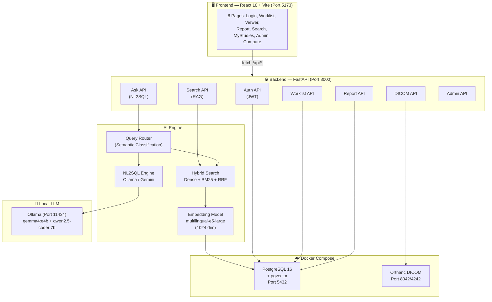
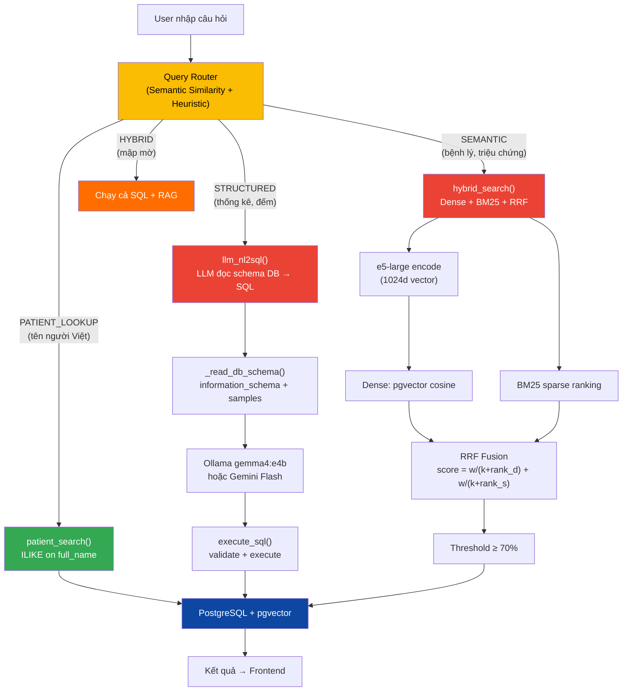
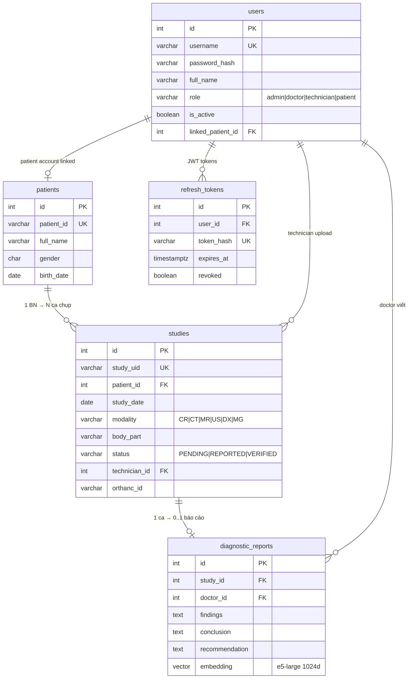
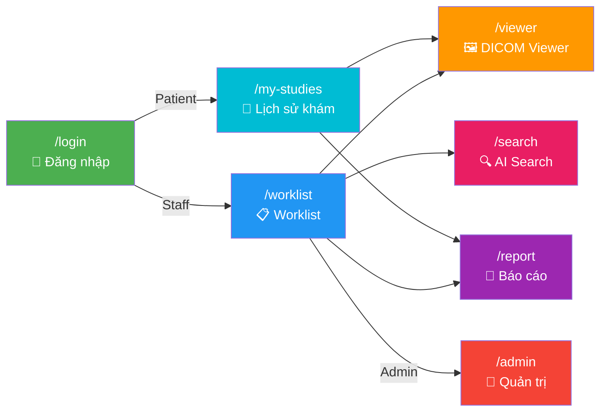

# 🏥 PACS++ — Hệ thống PACS tích hợp AI RAG Search

**Medical Imaging Management System with AI-Powered Intelligent Search**

> Hệ thống PACS mở rộng, tích hợp RAG (Retrieval-Augmented Generation) để hỗ trợ bác sĩ tìm kiếm và tra cứu kết quả chẩn đoán hình ảnh y tế thông minh.

---

## ✨ Tính năng chính

| Tính năng | Mô tả |
|---|---|
| 🔐 **4-Role Access Control** | Admin, Doctor, Technician, Patient — phân quyền đầy đủ |
| 🖼️ **DICOM Management** | Upload, lưu trữ, xem ảnh y tế (CT, MR, X-ray, MG) qua Orthanc |
| 📋 **Worklist** | Quản lý danh sách ca chụp với filter, sort, thống kê dashboard |
| 📝 **Diagnostic Reports** | Viết, sửa, xem báo cáo chẩn đoán + xuất PDF |
| 🧑 **Patient Portal** | Bệnh nhân xem lịch sử khám và kết quả của mình |
| 🔍 **RAG Search** | Tìm kiếm ngữ nghĩa: Dense + BM25 + Hybrid (RRF) |
| 🤖 **NL2SQL** | Hỏi đáp tự nhiên → LLM sinh SQL → thực thi |
| 🎨 **Hospital Dark Theme** | Giao diện tối chuyên nghiệp, phù hợp phòng đọc phim |

---

## 🏗️ Kiến trúc hệ thống



---

## 🔍 RAG Search Pipeline



### Pipeline chi tiết

| Step | Module | Chức năng |
|---|---|---|
| 1. Nhận query | `api/ask.py` + `api/search.py` | Frontend gọi `/api/ask` và `/api/search/keyword` |
| 2. Phân loại | `core/query_router.py` | Heuristic (tên Việt) + Embedding similarity → 4 intents |
| 3a. Tìm bệnh nhân | `core/rag_engine.py → patient_search()` | ILIKE chỉ trên `full_name` + `patient_id` |
| 3b. Thống kê SQL | `core/nl2sql_engine.py → llm_nl2sql()` | LLM đọc schema DB thật → sinh SQL → execute |
| 3c. Nội dung y khoa | `core/rag_engine.py → hybrid_search()` | Dense (pgvector cosine) + BM25 sparse + RRF fusion |
| 3d. Hybrid | Cả 3b + 3c | Chạy cả SQL và RAG |

---

## 📊 Database Schema



---

## 🔑 Phân quyền (4 Roles)

| Chức năng | 👑 Admin | 👨‍⚕️ Doctor | 🔧 Technician | 🧑 Patient |
|---|:---:|:---:|:---:|:---:|
| Xem Worklist | ✅ | ✅ | ✅ | ❌ |
| Upload DICOM | ✅ | ❌ | ✅ | ❌ |
| Xem ảnh DICOM | ✅ | ✅ | ✅ | Của mình |
| Viết báo cáo | ✅ | ✅ | ❌ | ❌ |
| Xem báo cáo | ✅ | ✅ | ✅ (readonly) | Của mình |
| AI Search | ✅ | ✅ | ❌ | ❌ |
| Admin Panel | ✅ | ❌ | ❌ | ❌ |
| My Studies | ❌ | ❌ | ❌ | ✅ |

---

## 📁 Cấu trúc dự án

```
pacs_rag_system/
├── docker-compose.yml                # PostgreSQL + Orthanc
├── orthanc/orthanc.json              # Orthanc config
│
├── backend-v2/                       # ⚙️ FastAPI Backend (Python 3.12)
│   ├── main.py                       # Entry point — 8 routers
│   ├── config.py                     # .env reader
│   ├── .env                          # DB, JWT, Ollama config
│   ├── requirements.txt              # Dependencies
│   │
│   ├── api/                          # API Endpoints (8 routers)
│   │   ├── auth.py                   # /api/auth — JWT login/register/refresh
│   │   ├── worklist.py               # /api/worklist — CRUD + filter + stats
│   │   ├── dicom.py                  # /api/dicom — Upload/download/instances
│   │   ├── report.py                 # /api/report — CRUD + PDF export
│   │   ├── search.py                 # /api/search — RAG search (UC12-14)
│   │   ├── ask.py                    # /api/ask — NL2SQL hỏi đáp (UC15)
│   │   ├── admin.py                  # /api/admin — User management
│   │   └── dicom_editor.py           # /api/editor — Sửa metadata DICOM
│   │
│   ├── core/                         # Business Logic
│   │   ├── auth_utils.py             # JWT + bcrypt hashing
│   │   ├── embeddings.py             # multilingual-e5-large (1024d)
│   │   ├── rag_engine.py             # Keyword + Dense + Hybrid + Patient search
│   │   ├── query_router.py           # Intent classifier (semantic similarity)
│   │   ├── nl2sql_engine.py          # NL → SQL (Ollama/Gemini)
│   │   ├── orthanc_client.py         # Orthanc REST client
│   │   └── dicom_parser.py           # pydicom tag parser
│   │
│   ├── database/                     # Database
│   │   ├── connection.py             # Connection pool (psycopg2)
│   │   ├── base.py                   # CRUD helpers
│   │   └── init_db.sql               # Schema: 5 tables + pgvector
│   │
│   ├── models/                       # Data Models
│   │   ├── patient.py, study.py, report.py, user.py, refresh_token.py
│   │
│   └── scripts/                      # Utility Scripts
│       ├── seed_data.py              # Seed accounts + patients
│       ├── seed_reports.py           # Seed 75 báo cáo y tế
│       ├── embed_existing.py         # Batch embed reports → vector
│       ├── bulk_upload.py            # Bulk upload DICOM
│       └── benchmark_embeddings.py   # Benchmark models
│
├── frontend-react/                   # 🖥️ React 18 Frontend (Vite 5)
│   ├── vite.config.js                # Proxy /api → :8000
│   └── src/
│       ├── App.jsx                   # Router + Auth guard
│       ├── api/                      # 6 API wrappers (auth, worklist, dicom, report, search, patient)
│       ├── hooks/useAuth.js          # JWT state management
│       ├── components/               # Layout (Sidebar, Topbar) + Shared (FilterBar, StatusBadge...)
│       ├── pages/                    # 8 pages: Login, Worklist, Viewer, Report, Search, MyStudies, Admin, Compare
│       └── styles/                   # Hospital dark theme (variables, base, layout, components)
│
└── docs/                             # 📚 Tài liệu thiết kế (11 files)
    ├── 00_project_overview.md        # Tổng quan dự án
    ├── 01_system_overview.md         # Kiến trúc + tech stack
    ├── 02_erd_database.md            # Database schema
    ├── 03_backend_architecture.md    # Backend API + RAG engine
    ├── 04_frontend_architecture.md   # Frontend pages + components
    ├── 05_sprint_roadmap.md          # Lộ trình phát triển
    ├── 06_ui_wireframes.md           # Wireframes
    ├── 07_feature_list.md            # 75 chức năng
    ├── 08_use_cases.md               # 18 use cases (UC01-UC18)
    ├── 09_graph_rag_plan.md          # [PLANNED] Graph RAG
    └── 10_graph_rag_analysis.md      # Phân tích Graph RAG
```

---

## 🌐 Frontend Pages



---

## 📡 API Endpoints

### Auth (`/api/auth`)
| Method | Endpoint | Auth | Mô tả |
|---|---|---|---|
| POST | `/api/auth/login` | ❌ | Đăng nhập → access + refresh token |
| POST | `/api/auth/register` | ❌ | Đăng ký tài khoản |
| POST | `/api/auth/refresh` | ✅ | Refresh access token |
| GET | `/api/auth/me` | ✅ | Thông tin user hiện tại |

### Worklist & DICOM
| Method | Endpoint | Auth | Mô tả |
|---|---|---|---|
| GET | `/api/worklist` | ✅ | Danh sách ca chụp (filter, sort, paginate) |
| GET | `/api/worklist/stats/dashboard` | ✅ | Thống kê: total, pending, reported, verified |
| GET | `/api/worklist/{id}` | ✅ | Chi tiết 1 ca chụp |
| POST | `/api/dicom/upload` | ✅ | Upload file .dcm → Orthanc |
| GET | `/api/dicom/instances/{id}` | ✅ | Lấy DICOM instances |

### Report
| Method | Endpoint | Auth | Mô tả |
|---|---|---|---|
| POST | `/api/report` | ✅ | Tạo báo cáo (auto-embed vector) |
| PUT | `/api/report/{id}` | ✅ | Cập nhật báo cáo |
| GET | `/api/report/{study_id}` | ✅ | Xem báo cáo |
| GET | `/api/report/{id}/pdf` | ✅ | Xuất PDF |

### AI Search
| Method | Endpoint | Auth | Mô tả |
|---|---|---|---|
| GET | `/api/search/keyword?q=` | ✅ | UC12: Keyword search (ILIKE) |
| POST | `/api/search` | ✅ | UC13-14: Dense / Hybrid search |
| POST | `/api/ask` | ✅ | UC15: NL2SQL + RAG hỏi đáp |

### Admin & Other
| Method | Endpoint | Auth | Mô tả |
|---|---|---|---|
| GET | `/api/admin/users` | ✅👑 | Danh sách users |
| PUT | `/api/admin/users/{id}` | ✅👑 | Cập nhật user |
| GET | `/health` | ❌ | Health check |

📖 Swagger UI: http://localhost:8000/docs

---

## 🚀 Hướng dẫn cài đặt

### Yêu cầu
- Python 3.12+
- Node.js 18+
- Docker Desktop
- Ollama

### 1. Khởi động Docker

```bash
cd pacs_rag_system
docker-compose up -d          # PostgreSQL 16 + Orthanc
```

### 2. Setup Backend

```bash
cd backend-v2
python -m venv venv
venv\Scripts\activate         # Windows
pip install -r requirements.txt
python scripts/seed_data.py   # Tạo data mẫu
python main.py                # → http://localhost:8000
```

### 3. Setup Frontend

```bash
cd frontend-react
npm install
npm run dev                   # → http://localhost:5173
```

### 4. Setup Ollama (AI)

```bash
ollama serve                  # → http://localhost:11434
ollama pull gemma4:e4b        # Entity extraction
ollama pull qwen2.5-coder:7b  # NL2SQL (legacy)
```

---

## 🔑 Test Accounts

| Username | Password | Role |
|---|---|---|
| admin | admin123 | 👑 Admin |
| dr.nam | doctor123 | 👨‍⚕️ Doctor |
| dr.lan | doctor123 | 👨‍⚕️ Doctor |
| tech.hung | tech123 | 🔧 Technician |
| tech.mai | tech123 | 🔧 Technician |

Patient accounts: `{PatientID}` / `{PatientID}@`

---

## 🛠️ Tech Stack

| Layer | Công nghệ |
|---|---|
| **Backend** | FastAPI, Python 3.12, Uvicorn |
| **Database** | PostgreSQL 16 + pgvector (1024d vectors) |
| **DICOM Server** | Orthanc (Docker) |
| **Embedding** | multilingual-e5-large (intfloat) |
| **NL2SQL** | Ollama (gemma4:e4b) / Gemini 2.0 Flash (fallback) |
| **Search** | BM25 (rank-bm25) + pgvector cosine + RRF fusion |
| **Auth** | JWT (python-jose) + bcrypt |
| **Frontend** | React 18 + Vite 5 + React Router v6 |
| **CSS** | Vanilla CSS — Hospital Dark Theme |
| **PDF** | ReportLab |
| **Infrastructure** | Docker Compose |

---

## 📈 Dữ liệu hiện có

| Bảng | Số lượng |
|---|---|
| patients | 21 bệnh nhân |
| users | 26 tài khoản (5 staff + 21 patient) |
| studies | 75 ca chụp |
| diagnostic_reports | 75 báo cáo (100% embedded) |
| DICOM files (Orthanc) | 13,495 ảnh |

---

## ✅ Roadmap

- [x] Sprint 0: Infrastructure (Docker, PostgreSQL, Orthanc, Ollama)
- [x] Sprint 1: Backend core (Auth, Worklist, DICOM, Report, Seed data, Bulk upload 13K DICOM)
- [x] Sprint 2: Frontend 8 pages (Login, Worklist, Viewer, Report, Search, MyStudies, Admin, Compare)
- [x] Sprint 3: RAG Engine (e5-large embedding, Dense/Hybrid search, NL2SQL, Query Router)
- [x] Sprint 4: Polish (PDF export, Admin CRUD, Responsive layout)
- [ ] Sprint 5: Graph RAG (NetworkX + Gemma 4 entity extraction) — [planned](docs/09_graph_rag_plan.md)

---

## 📚 Tài liệu

Xem thư mục [docs/](docs/) cho 11 file tài liệu thiết kế chi tiết.

---

## 👤 Tác giả

**Hoàng Đức Long** — JAVIS AI

## 📄 License

This project is for educational purposes.
