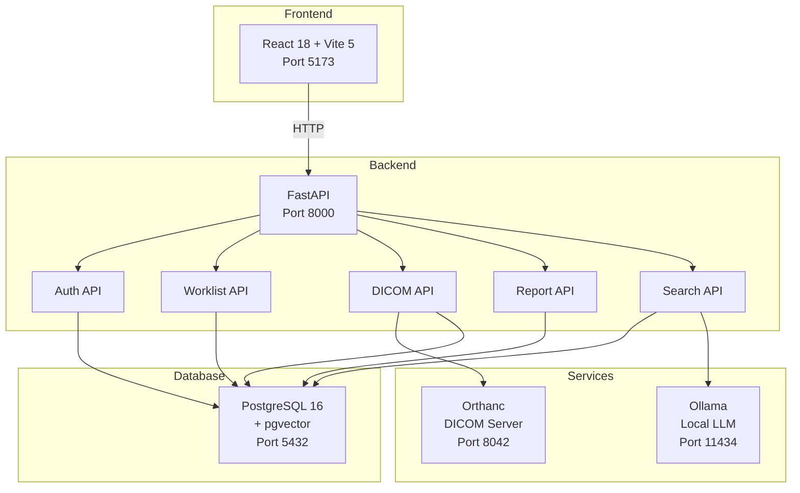
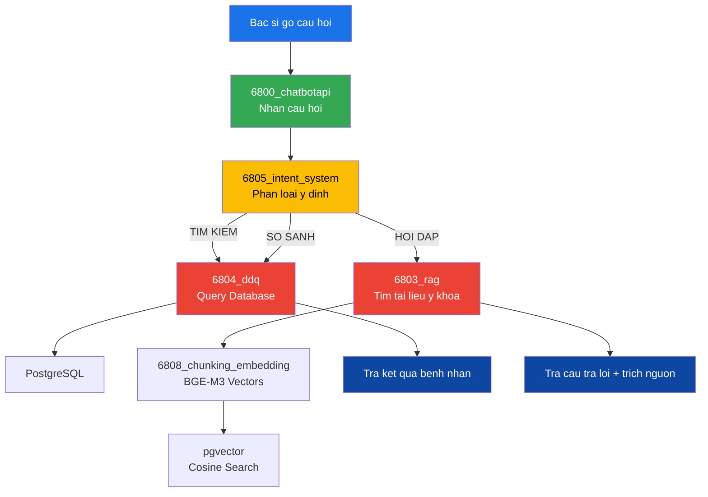
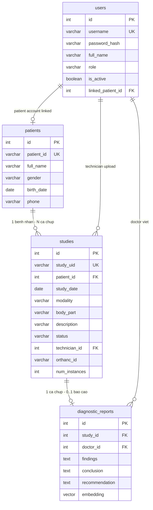
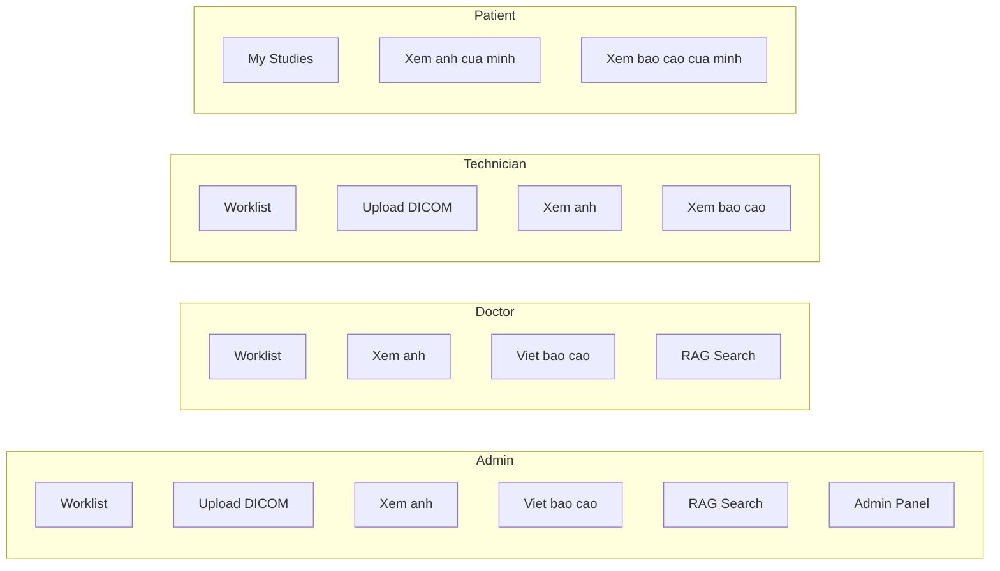
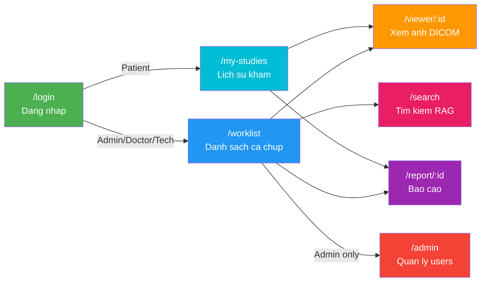

# PACS++ — He thong PACS tich hop RAG

**Medical Imaging Management System with AI-Powered Search**

---

## Gioi thieu

PACS++ la he thong PACS (Picture Archiving and Communication System) mo rong, tich hop cong nghe RAG (Retrieval-Augmented Generation) de ho tro tim kiem va tra cuu hinh anh y te thong minh.

### Tinh nang chinh

- 4-Role Access Control: Admin, Doctor, Technician, Patient
- DICOM Management: Upload, luu tru, xem anh y te (CT, MR, X-ray, MG)
- Worklist Management: Quan ly danh sach ca chup voi filter va thong ke
- Diagnostic Reports: Viet, sua, xem bao cao chan doan
- Patient Portal: Benh nhan xem lich su kham va ket qua
- RAG Search: Tim kiem ngu nghia trong bao cao (Dense + Hybrid + NL2SQL)
- Hospital Dark Theme: Giao dien toi phu hop phong doc phim

---

## Kien truc he thong



---

## RAG Pipeline



### Micro-services

| Service | Chuc nang |
|---|---|
| 6800_chatbotapi | API gateway, nhan cau hoi tu frontend |
| 6801_llms_gateway | Gateway goi cac LLM (Ollama, Gemini) |
| 6803_rag | RAG engine - tim kiem tai lieu y khoa |
| 6803_preprocessing | Tien xu ly van ban y khoa |
| 6804_ddq | Data-Driven Query - NL2SQL, truy van database |
| 6805_intent_system | Phan loai y dinh cau hoi |
| 6808_chungking_embbedding_local | Chunking + Embedding van ban (BGE-M3) |

---

## Database Schema (ERD)



---

## Phan quyen (4 Roles)



---

## Cau truc du an

```
pacs_rag_system/
|-- docker-compose.yml
|-- orthanc/orthanc.json
|
|-- backend-v2/                     # FastAPI Backend
|   |-- main.py                     # Entry point - port 8000
|   |-- config.py                   # .env reader
|   |-- requirements.txt
|   |-- api/
|   |   |-- auth.py                 # Login + JWT
|   |   |-- worklist.py             # Worklist + stats + filter
|   |   |-- dicom.py                # Upload + WADO
|   |   |-- report.py               # CRUD bao cao
|   |   |-- search.py               # RAG search
|   |   |-- ask.py                  # NL2SQL
|   |   +-- patient_portal.py       # Patient: lich su kham
|   |-- core/
|   |   |-- auth_utils.py           # JWT + bcrypt
|   |   |-- dicom_parser.py         # pydicom metadata
|   |   |-- orthanc_client.py       # Orthanc REST client
|   |   |-- embeddings.py           # BGE-M3 encoder
|   |   |-- rag_engine.py           # Dense + BM25 + Hybrid
|   |   |-- nl2sql_engine.py        # NL -> SQL (Ollama)
|   |   +-- query_router.py         # Intent classifier
|   |-- database/
|   |   |-- connection.py           # Connection pool
|   |   +-- init_db.sql             # Schema + pgvector
|   +-- scripts/
|       |-- seed_data.py            # Seed staff accounts
|       |-- edit_names.py           # Edit DICOM names
|       +-- bulk_upload.py          # Bulk upload 13K files
|
|-- frontend-react/                 # React 18 Frontend
|   |-- vite.config.js              # Proxy /api -> :8000
|   +-- src/
|       |-- App.jsx                 # Router + Auth guard
|       |-- api/                    # API wrappers
|       |-- hooks/useAuth.js        # JWT state
|       |-- components/             # Shared components
|       |-- pages/Login/            # Login page (done)
|       +-- styles/                 # Hospital dark theme
|
+-- docs/                           # 8 tai lieu thiet ke
```

---

## Frontend Pages



---

## API Endpoints

### Auth
| Method | Endpoint | Auth | Mo ta |
|---|---|---|---|
| POST | /api/auth/login | No | Dang nhap, tra JWT token |
| GET | /api/auth/me | Yes | Thong tin user hien tai |

### Worklist
| Method | Endpoint | Auth | Mo ta |
|---|---|---|---|
| GET | /api/worklist | Yes | Danh sach ca chup (+ filter) |
| GET | /api/worklist/stats/dashboard | Yes | Thong ke dashboard |
| GET | /api/worklist/{id} | Yes | Chi tiet 1 ca chup |

### DICOM
| Method | Endpoint | Auth | Mo ta |
|---|---|---|---|
| POST | /api/dicom/upload | Yes | Upload file .dcm |
| GET | /api/dicom/wado?objectId=xxx | Yes | Stream anh DICOM |

### Report
| Method | Endpoint | Auth | Mo ta |
|---|---|---|---|
| GET | /api/report/{study_id} | Yes | Xem bao cao |
| POST | /api/report | Yes | Tao bao cao |
| PUT | /api/report/{id} | Yes | Cap nhat bao cao |

### RAG Search
| Method | Endpoint | Auth | Mo ta |
|---|---|---|---|
| POST | /api/search | Yes | Tim kiem: keyword, dense, hybrid |
| POST | /api/ask | Yes | Hoi dap NL2SQL + RAG |

### Other
| Method | Endpoint | Auth | Mo ta |
|---|---|---|---|
| GET | /api/my-studies | Yes | Patient: lich su kham |
| GET | /api/admin/users | Yes | Admin: danh sach users |
| GET | /health | No | Health check |

Swagger UI: http://localhost:8000/docs

---

## Huong dan cai dat

### Yeu cau

- Python 3.12+
- Node.js 18+
- Docker Desktop

### 1. Khoi dong Docker

```bash
cd pacs_rag_system
docker-compose up -d
```

### 2. Setup Backend

```bash
cd backend-v2
python -m venv venv
venv\Scripts\activate
pip install -r requirements.txt
python scripts/seed_data.py
python main.py
```

### 3. Setup Frontend

```bash
cd frontend-react
npm install
npm run dev
```

---

## Test Accounts

| Username | Password | Role |
|---|---|---|
| admin | admin123 | Admin |
| dr.nam | doctor123 | Doctor |
| dr.lan | doctor123 | Doctor |
| tech.hung | tech123 | Technician |
| tech.mai | tech123 | Technician |

Patient: {PatientID} / {PatientID}@

---

## Tech Stack

### Backend
- FastAPI, PostgreSQL 16 + pgvector, Orthanc, pydicom, python-jose, bcrypt

### RAG Engine
- BGE-M3 (BAAI/bge-m3), FlagEmbedding, pgvector, Ollama (qwen2.5-coder:7b), BM25, RRF

### Frontend
- React 18, Vite 5, React Router v6, Vanilla CSS, Cornerstone.js

### Infrastructure
- Docker Compose, Orthanc REST API, Ollama

---

## Roadmap

- [x] Sprint 1: Backend core (Auth, Worklist, DICOM, Report APIs)
- [x] Sprint 1: Data pipeline (DICOM name editor + bulk upload 13K files)
- [x] Sprint 1: Login page (React)
- [x] Sprint 2: Frontend pages (Worklist, Viewer, Report, Admin, MyStudies)
- [ ] Sprint 3: RAG Engine (BGE-M3 embedding, Dense/Hybrid search, NL2SQL)
- [ ] Sprint 4: Polish, testing, documentation

---

## Tac gia

Hoang Duc Long — JAVIS AI

## License

This project is for educational purposes.
