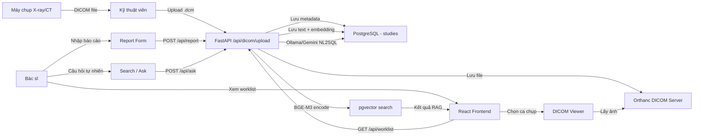

# 01 — Tổng quan hệ thống PACS++

## Mô tả dự án

**PACS++** là hệ thống lưu trữ và truyền tải hình ảnh y tế (PACS - Picture Archiving and Communication System) tích hợp AI tìm kiếm thông minh dựa trên RAG (Retrieval-Augmented Generation).

**Mục tiêu:** Giúp bác sĩ và kỹ thuật viên X-quang quản lý, tra cứu kết quả chẩn đoán hình ảnh (CT, MRI, X-ray...) một cách nhanh chóng và thông minh.

---

## Công nghệ sử dụng

### Backend

| Thành phần | Công nghệ | Mục đích |
|---|---|---|
| Web Framework | **FastAPI** (Python 3.12) | REST API, serving |
| ASGI Server | **Uvicorn** | HTTP server với hot-reload |
| Database | **PostgreSQL 16** | Lưu trữ dữ liệu chính |
| Vector Extension | **pgvector** | Lưu embedding vectors (1024 dim) |
| DICOM Server | **Orthanc** (Docker) | Lưu trữ ảnh DICOM |
| Embedding Model | **multilingual-e5-large** (intfloat) | Text → Vector 1024d cho RAG |
| NL2SQL (Local) | **Ollama** (gemma4:e4b) | Chuyển câu hỏi → SQL |
| NL2SQL (Cloud) | **Gemini 2.0 Flash** | Fallback khi Ollama không có |
| Auth | **JWT** (python-jose) | Xác thực người dùng |
| PDF Export | **ReportLab** | Xuất báo cáo PDF |
| Container | **Docker Compose** | Tách PostgreSQL + Orthanc |

### Frontend

| Thành phần | Công nghệ | Mục đích |
|---|---|---|
| UI Framework | **React 18** | Component-based UI |
| Routing | **React Router v6** | SPA navigation |
| Build Tool | **Vite** | HMR, bundling, dev server |
| CSS | **Vanilla CSS** (custom) | Custom design system |
| Font | **Inter + JetBrains Mono** | Typography |
| HTTP Client | **fetch API** | Gọi REST API backend |

### Infrastructure

```
┌─────────────────────────────────────────────────────┐
│                   Docker Compose                    │
│  ┌──────────────────┐   ┌───────────────────────┐  │
│  │   PostgreSQL 16   │   │   Orthanc DICOM       │  │
│  │   + pgvector      │   │   Port: 8042 (HTTP)   │  │
│  │   Port: 5432      │   │   Port: 4242 (DICOM)  │  │
│  └──────────────────┘   └───────────────────────┘  │
└─────────────────────────────────────────────────────┘

┌─────────────────────────────────────────────────────┐
│            FastAPI Backend (Port 8000)               │
│   Serve static files + REST API /api/*              │
└─────────────────────────────────────────────────────┘

┌─────────────────────────────────────────────────────┐
│            Vite Dev Server (Port 5173)               │
│   React SPA — proxy /api/* → localhost:8000          │
└─────────────────────────────────────────────────────┘

┌─────────────────────────────────────────────────────┐
│       Ollama (Port 11434) — Local LLM               │
│       Model: qwen2.5-coder:7b                       │
└─────────────────────────────────────────────────────┘
```

---

## Vai trò người dùng

| Role | Tên | Quyền hạn |
|---|---|---|
| `admin` | Quản trị viên | Toàn quyền |
| `doctor` | Bác sĩ | Xem worklist, đọc báo cáo, tìm kiếm |
| `technician` | Kỹ thuật viên | Xem worklist, upload DICOM |
| `patient` | Bệnh nhân | Xem ca chụp và báo cáo của mình |

---

## Luồng dữ liệu tổng quát


