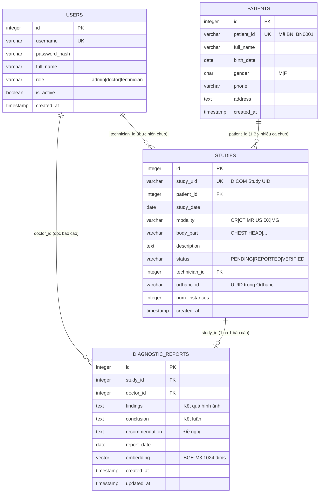

# 02 — ERD: Database Schema PACS++

## Sơ đồ quan hệ thực thể (ERD)



---

## Chi tiết từng bảng

### 1. `users` — Người dùng hệ thống

| Column | Type | Constraint | Mô tả |
|---|---|---|---|
| `id` | SERIAL | PK | Auto increment |
| `username` | VARCHAR(50) | UNIQUE, NOT NULL | Tên đăng nhập |
| `password_hash` | VARCHAR(255) | NOT NULL | Bcrypt hash |
| `full_name` | VARCHAR(100) | NOT NULL | Họ tên đầy đủ |
| `role` | VARCHAR(20) | CHECK | `admin/doctor/technician` |
| `is_active` | BOOLEAN | DEFAULT TRUE | Khoá tài khoản |
| `created_at` | TIMESTAMP | DEFAULT NOW() | Ngày tạo |

**Index:** `idx_users_username` trên `username`

---

### 2. `patients` — Bệnh nhân

| Column | Type | Constraint | Mô tả |
|---|---|---|---|
| `id` | SERIAL | PK | Auto increment |
| `patient_id` | VARCHAR(20) | UNIQUE, NOT NULL | Mã bệnh nhân (BN0001) |
| `full_name` | VARCHAR(100) | NOT NULL | Họ tên |
| `birth_date` | DATE | | Ngày sinh |
| `gender` | CHAR(1) | CHECK M\|F | Giới tính |
| `phone` | VARCHAR(20) | | Số điện thoại |
| `address` | TEXT | | Địa chỉ |
| `created_at` | TIMESTAMP | DEFAULT NOW() | Ngày tạo |

**Index:** `idx_patients_patient_id` trên `patient_id`

---

### 3. `studies` — Ca chụp

| Column | Type | Constraint | Mô tả |
|---|---|---|---|
| `id` | SERIAL | PK | Auto increment |
| `study_uid` | VARCHAR(128) | UNIQUE, NOT NULL | DICOM Study UID |
| `patient_id` | INTEGER | FK → patients | Bệnh nhân |
| `study_date` | DATE | | Ngày chụp |
| `modality` | VARCHAR(10) | | CR/CT/MR/US/DX/MG |
| `body_part` | VARCHAR(50) | | Vị trí chụp |
| `description` | TEXT | | Mô tả |
| `status` | VARCHAR(20) | DEFAULT 'PENDING' | PENDING/REPORTED/VERIFIED |
| `technician_id` | INTEGER | FK → users | KTV thực hiện |
| `orthanc_id` | VARCHAR(100) | | UUID file DICOM trên Orthanc |
| `num_instances` | INTEGER | DEFAULT 0 | Số ảnh DICOM |
| `created_at` | TIMESTAMP | DEFAULT NOW() | Ngày tạo |

**Index:**
- `idx_studies_patient_id` trên `patient_id`
- `idx_studies_study_date` trên `study_date`
- `idx_studies_status` trên `status`

---

### 4. `diagnostic_reports` — Báo cáo chẩn đoán

| Column | Type | Constraint | Mô tả |
|---|---|---|---|
| `id` | SERIAL | PK | Auto increment |
| `study_id` | INTEGER | FK → studies, UNIQUE | Ca chụp (1-1) |
| `doctor_id` | INTEGER | FK → users | Bác sĩ đọc |
| `findings` | TEXT | NOT NULL | Kết quả hình ảnh |
| `conclusion` | TEXT | NOT NULL | Kết luận chẩn đoán |
| `recommendation` | TEXT | | Đề nghị xử trí |
| `report_date` | DATE | DEFAULT NOW() | Ngày báo cáo |
| `embedding` | VECTOR(1024) | | BGE-M3 vector của findings+conclusion |
| `created_at` | TIMESTAMP | DEFAULT NOW() | Ngày tạo |
| `updated_at` | TIMESTAMP | | Ngày cập nhật |

**Index (pgvector):**
- `idx_reports_embedding` dùng `ivfflat` với `vector_cosine_ops` — tìm kiếm ANN

---

## Quan hệ tóm tắt

```
users (1) ──────────── (nhiều) studies       [technician_id]
users (1) ──────────── (nhiều) reports       [doctor_id]
patients (1) ────────── (nhiều) studies      [patient_id]
studies (1) ─────────── (0 hoặc 1) reports  [study_id UNIQUE]
```

## Ghi chú kỹ thuật

- Extension cần bật trong PostgreSQL: `CREATE EXTENSION IF NOT EXISTS vector;`
- Embedding được tạo bằng `BGEM3FlagModel` từ `FlagEmbedding`, dimension = **1024**
- Khi báo cáo được lưu → trigger tự động update `studies.status` = `'REPORTED'`
- `orthanc_id` lưu UUID do Orthanc sinh ra sau khi upload DICOM, dùng để lấy ảnh qua WADO protocol
