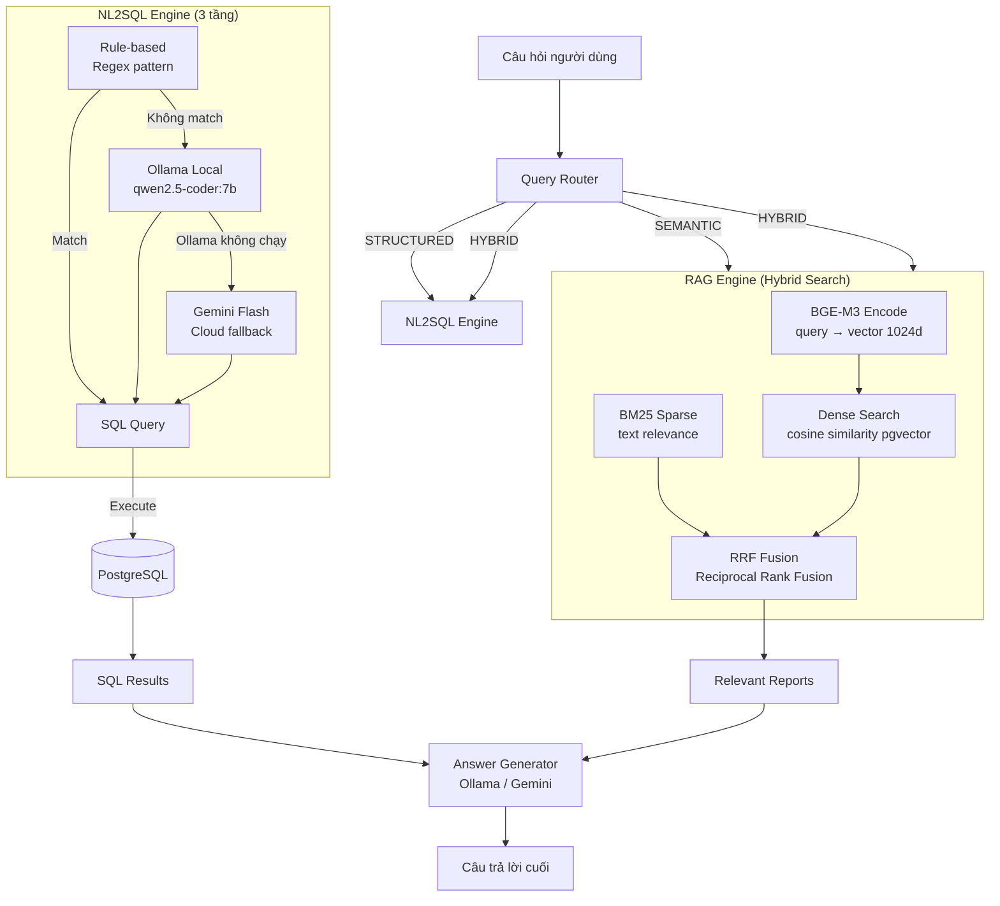
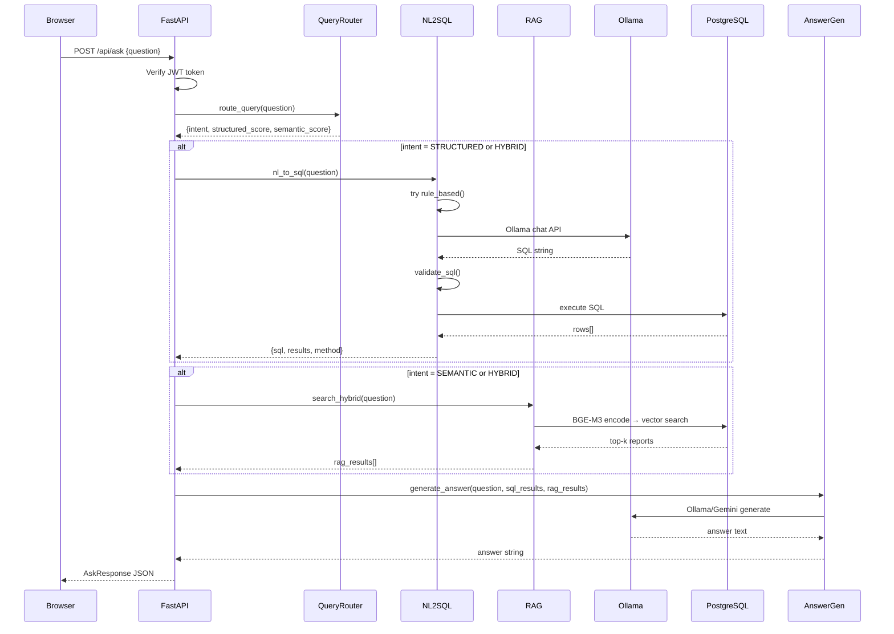

# 03 — Backend Architecture: API & Business Logic

## Cấu trúc thư mục Backend

```
backend/
├── main.py                  # FastAPI app entry — khai báo routers, static files
├── config.py                # Đọc .env: DB, JWT, Ollama, Gemini
├── requirements.txt         # Dependencies
├── .env                     # API keys, DB config (không commit Git)
│
├── api/                     # Routers — xử lý HTTP requests
│   ├── auth.py              # POST /api/auth/login, GET /api/auth/me
│   ├── worklist.py          # GET /api/worklist, GET /api/worklist/stats
│   ├── dicom.py             # POST /api/dicom/upload, GET /api/dicom/wado
│   ├── report.py            # CRUD /api/report/{id}
│   ├── search.py            # POST /api/search (keyword/dense/hybrid)
│   └── ask.py               # POST /api/ask (unified NL2SQL + RAG)
│
├── core/                    # Business logic
│   ├── auth_utils.py        # hash_password, verify_password, JWT encode/decode
│   ├── embedding_model.py   # Singleton BGEM3FlagModel loader
│   ├── rag_engine.py        # Dense search, Hybrid search (BM25 + RRF)
│   ├── nl2sql_engine.py     # Rule-based → Ollama → Gemini fallback
│   ├── query_router.py      # Phân loại: STRUCTURED / SEMANTIC / HYBRID
│   ├── answer_generator.py  # Tổng hợp câu trả lời từ kết quả SQL + RAG
│   └── orthanc_client.py    # Gọi Orthanc REST API (upload, getWado, health)
│
├── database/
│   ├── connection.py        # Pool kết nối PostgreSQL, hàm execute/fetch
│   └── schema.sql           # DDL tạo bảng + indexes
│
└── scripts/
    └── seed_data.py         # Tạo dữ liệu mẫu (5 users, 30 BN, 44 ca chụp)
```

---

## Danh sách API Endpoints

### Auth — `/api/auth`

| Method | Path | Auth | Mô tả |
|---|---|---|---|
| POST | `/api/auth/login` | Không | Đăng nhập → trả JWT token |
| GET | `/api/auth/me` | Có | Lấy thông tin user hiện tại |

---

### Worklist — `/api/worklist`

| Method | Path | Auth | Role | Mô tả |
|---|---|---|---|---|
| GET | `/api/worklist` | Có | All | Danh sách ca chụp (filter: date, modality, status) |
| GET | `/api/worklist/{id}` | Có | All | Chi tiết 1 ca chụp |
| GET | `/api/worklist/stats/dashboard` | Có | All | Thống kê: total, pending, reported, verified |

**Query params:** `?date=2024-03-01&modality=CT&status=PENDING&limit=50&offset=0`

---

### DICOM — `/api/dicom`

| Method | Path | Auth | Role | Mô tả |
|---|---|---|---|---|
| POST | `/api/dicom/upload` | Có | tech/admin | Upload file .dcm → Orthanc + lưu metadata DB |
| GET | `/api/dicom/wado` | Có | All | Proxy lấy ảnh DICOM từ Orthanc |

---

### Report — `/api/report`

| Method | Path | Auth | Role | Mô tả |
|---|---|---|---|---|
| GET | `/api/report/{study_id}` | Có | All | Lấy báo cáo của 1 ca chụp |
| POST | `/api/report` | Có | doctor/admin | Tạo mới báo cáo |
| PUT | `/api/report/{id}` | Có | doctor/admin | Cập nhật báo cáo |
| GET | `/api/report/{id}/pdf` | Có | All | Xuất PDF báo cáo |

---

### Search — `/api/search`

| Method | Path | Auth | Mô tả |
|---|---|---|---|
| GET | `/api/search/keyword` | Có | Tìm keyword trong findings/conclusion (SQL ILIKE) |
| POST | `/api/search` | Có | Tìm kiếm ngữ nghĩa (body: `{query, top_k, method}`) |

**method:** `dense` (chỉ BGE-M3) hoặc `hybrid` (Dense + BM25 + RRF)

---

### Ask — `/api/ask`

| Method | Path | Auth | Mô tả |
|---|---|---|---|
| POST | `/api/ask` | Có | Unified endpoint — tự phân loại STRUCTURED/SEMANTIC/HYBRID |

```json
// Request body
{
  "question": "bao nhiêu ca CT trong tháng 3?",
  "top_k": 5,
  "use_rag": true,
  "generate_text": true
}

// Response
{
  "intent": "STRUCTURED",
  "sql_query": "SELECT COUNT(*) AS total FROM studies WHERE modality='CT'...",
  "sql_method": "rule_based",
  "sql_results": [{"total": 12}],
  "rag_results": [],
  "answer": "Có 12 ca chụp CT trong tháng 3."
}
```

---

## RAG Engine — Cơ chế tìm kiếm



---

## NL2SQL — 3 tầng logic

### Tầng 1: Rule-based (không cần LLM)
Dùng **Regex pattern** cho các câu hỏi phổ biến:
- `"ca chưa đọc"` → `WHERE status='PENDING'`
- `"bao nhiêu ca hôm nay"` → `WHERE study_date=CURRENT_DATE`
- `"bao nhiêu ca tuần này"` → `WHERE study_date >= date_trunc('week', ...)`

### Tầng 2: Ollama (local, nhanh, riêng tư)
- Model: `qwen2.5-coder:7b`
- System prompt: Schema ngắn gọn (<100 token)
- Output: SQL SELECT trực tiếp, không giải thích

### Tầng 3: Gemini Flash (cloud fallback)
- Chỉ khi Ollama không chạy và `GEMINI_API_KEY` được set
- Cùng prompt strategy với Ollama

**SQL Validator:** Sau khi sinh SQL, bắt buộc validate:
- Chỉ chấp nhận `SELECT`
- Không có `DROP/DELETE/UPDATE/INSERT`
- Không truy cập cột `embedding`
- Chỉ truy vấn các bảng đã khai báo

---

## Request Flow chi tiết (POST /api/ask)


