# 08 — Use Cases PACS++

## Danh sách Actor (Tác nhân)

| Actor | Mô tả |
|---|---|
| **Quản trị viên (Admin)** | Toàn quyền hệ thống, quản lý tài khoản |
| **Bác sĩ (Doctor)** | Đọc phim, viết báo cáo, tìm kiếm |
| **Kỹ thuật viên (Technician)** | Thực hiện chụp, upload DICOM |
| **Hệ thống (System)** | Xử lý tự động: embedding, status update |

---

## Sơ đồ Use Case tổng quan

```mermaid
flowchart TD
    ADMIN([Quản trị viên])
    DOCTOR([Bác sĩ])
    TECH([Kỹ thuật viên])
    SYS([Hệ thống])

    subgraph AUTH ["🔐 Xác thực"]
        UC1[UC01: Đăng nhập]
        UC2[UC02: Đăng xuất]
    end

    subgraph WORKLIST ["📋 Quản lý Worklist"]
        UC3[UC03: Xem danh sách ca chụp]
        UC4[UC04: Lọc danh sách ca chụp]
        UC5[UC05: Xem thống kê dashboard]
    end

    subgraph DICOM ["🖼️ DICOM"]
        UC6[UC06: Upload file DICOM]
        UC7[UC07: Xem ảnh DICOM]
    end

    subgraph REPORT ["📝 Báo cáo"]
        UC8[UC08: Tạo báo cáo chẩn đoán]
        UC9[UC09: Cập nhật báo cáo]
        UC10[UC10: Xem báo cáo]
        UC11[UC11: Xuất PDF báo cáo]
    end

    subgraph SEARCH ["🔍 Tìm kiếm"]
        UC12[UC12: Tìm kiếm từ khoá]
        UC13[UC13: Tìm kiếm ngữ nghĩa]
        UC14[UC14: Tìm kiếm hybrid]
        UC15[UC15: Hỏi đáp tự nhiên NL2SQL]
    end

    subgraph ADMIN_GRP ["⚙️ Quản trị"]
        UC16[UC16: Xem danh sách users]
        UC17[UC17: Xem thông tin hệ thống]
    end

    subgraph AUTO ["🤖 Tự động"]
        UC18[UC18: Tự động tạo embedding]
    end

    ADMIN --> UC1 & UC2 & UC3 & UC4 & UC5
    ADMIN --> UC6 & UC7 & UC8 & UC9 & UC10 & UC11
    ADMIN --> UC12 & UC13 & UC14 & UC15
    ADMIN --> UC16 & UC17

    DOCTOR --> UC1 & UC2 & UC3 & UC4 & UC5
    DOCTOR --> UC7 & UC8 & UC9 & UC10 & UC11
    DOCTOR --> UC12 & UC13 & UC14 & UC15

    TECH --> UC1 & UC2 & UC3 & UC4 & UC5
    TECH --> UC6 & UC7 & UC10 & UC11

    SYS --> UC18
    UC8 -.->|kích hoạt| UC18
    UC9 -.->|kích hoạt| UC18
```

---

## Chi tiết từng Use Case

---

### UC01 — Đăng nhập hệ thống

| Trường | Nội dung |
|---|---|
| **ID** | UC01 |
| **Tên** | Đăng nhập hệ thống |
| **Actor** | Admin, Doctor, Technician |
| **Tiền điều kiện** | Người dùng chưa đăng nhập, hệ thống đang chạy |
| **Hậu điều kiện** | Người dùng được xác thực, JWT token được lưu, chuyển về Worklist |

**Luồng chính:**
1. Người dùng mở ứng dụng tại `http://localhost:5173`
2. Hệ thống phát hiện chưa có token → chuyển về `/login`
3. Người dùng nhập username và password
4. Người dùng nhấn "Đăng nhập"
5. Hệ thống gọi `POST /api/auth/login`
6. Backend xác thực password với bcrypt hash
7. Backend trả về JWT token + thông tin user (role, full_name)
8. Frontend lưu token vào localStorage
9. Hệ thống chuyển hướng về `/worklist`

**Luồng thay thế:**
- **3a.** Username không tồn tại → hiện thông báo "Sai thông tin đăng nhập"
- **3b.** Password sai → hiện thông báo "Sai thông tin đăng nhập"
- **3c.** Tài khoản bị khoá (is_active=false) → hiện thông báo "Tài khoản đã bị khoá"

---

### UC02 — Đăng xuất

| Trường | Nội dung |
|---|---|
| **ID** | UC02 |
| **Actor** | Admin, Doctor, Technician |
| **Tiền điều kiện** | Người dùng đã đăng nhập |
| **Hậu điều kiện** | Token bị xoá khỏi localStorage, chuyển về `/login` |

**Luồng chính:**
1. Người dùng nhấn nút "Thoát" ở sidebar footer
2. Hệ thống xoá `pacs_token` và `pacs_user` khỏi localStorage
3. Hệ thống chuyển hướng về `/login`

---

### UC03 — Xem danh sách ca chụp (Worklist)

| Trường | Nội dung |
|---|---|
| **ID** | UC03 |
| **Actor** | Admin, Doctor, Technician |
| **Tiền điều kiện** | Đã đăng nhập |
| **Hậu điều kiện** | Danh sách ca chụp hiển thị |

**Luồng chính:**
1. Người dùng vào trang `/worklist`
2. Hệ thống gọi `GET /api/worklist`
3. Backend truy vấn bảng `studies` JOIN `patients`, JOIN `users`
4. Trả về danh sách ca chụp với: tên BN, mã BN, ngày chụp, modality, vị trí, trạng thái, tên KTV
5. Frontend hiển thị dạng bảng

**Dữ liệu mỗi dòng:**

| Cột | Nguồn |
|---|---|
| Tên bệnh nhân | patients.full_name |
| Mã bệnh nhân | patients.patient_id |
| Ngày chụp | studies.study_date |
| Loại chụp | studies.modality |
| Vị trí | studies.body_part |
| Trạng thái | studies.status |
| Kỹ thuật viên | users.full_name (technician) |

---

### UC04 — Lọc danh sách ca chụp

| Trường | Nội dung |
|---|---|
| **ID** | UC04 |
| **Actor** | Admin, Doctor, Technician |
| **Tiền điều kiện** | Đang xem Worklist |
| **Hậu điều kiện** | Danh sách được lọc theo tiêu chí |

**Luồng chính:**
1. Người dùng chọn 1 hoặc nhiều bộ lọc:
   - Ngày chụp (date picker)
   - Loại chụp (CR / CT / MR / US / DX / MG)
   - Trạng thái (PENDING / REPORTED / VERIFIED)
2. Nhấn "Lọc"
3. Hệ thống gọi `GET /api/worklist?date=...&modality=...&status=...`
4. Kết quả cập nhật bảng

**Luồng thay thế:**
- Nhấn "Xoá bộ lọc" → xoá tất cả filter, tải lại toàn bộ danh sách

---

### UC05 — Xem thống kê dashboard

| Trường | Nội dung |
|---|---|
| **ID** | UC05 |
| **Actor** | Admin, Doctor, Technician |
| **Tiền điều kiện** | Đang ở trang Worklist |
| **Hậu điều kiện** | 4 stat cards hiển thị số liệu |

**Luồng chính:**
1. Trang Worklist load
2. Hệ thống gọi `GET /api/worklist/stats/dashboard`
3. Backend đếm: tổng ca, pending, reported, verified
4. Hiển thị 4 cards: Tổng / Chờ đọc / Đã báo cáo / Đã xác nhận

---

### UC06 — Upload file DICOM

| Trường | Nội dung |
|---|---|
| **ID** | UC06 |
| **Actor** | Technician, Admin |
| **Tiền điều kiện** | Đã đăng nhập, có file .dcm từ máy chụp |
| **Hậu điều kiện** | File DICOM trên Orthanc, metadata trong PostgreSQL, worklist cập nhật |

**Luồng chính:**
1. KTV kéo file .dcm vào vùng upload (hoặc click chọn)
2. Frontend gửi `POST /api/dicom/upload` với FormData
3. Backend đọc DICOM tags: PatientName, PatientID, StudyDate, Modality, BodyPart, StudyInstanceUID
4. Backend forward file lên Orthanc REST API
5. Orthanc trả về UUID (orthanc_id)
6. Backend lưu study record vào PostgreSQL (kèm orthanc_id)
7. Frontend làm mới worklist và stat cards

**Luồng thay thế:**
- **1a.** File không phải .dcm → hiện lỗi "Chỉ chấp nhận file .dcm"
- **4a.** Orthanc không chạy → hiện lỗi "Không thể kết nối DICOM server"
- **6a.** Study UID đã tồn tại → cập nhật thay vì tạo mới

---

### UC07 — Xem ảnh DICOM

| Trường | Nội dung |
|---|---|
| **ID** | UC07 |
| **Actor** | Admin, Doctor, Technician |
| **Tiền điều kiện** | Ca chụp tồn tại trong worklist |
| **Hậu điều kiện** | Ảnh DICOM hiển thị (nếu đã upload) |

**Luồng chính:**
1. Người dùng click dòng ca chụp hoặc nút "Xem" trên worklist
2. Hệ thống chuyển sang `/viewer?studyId=X&orthancId=Y`
3. Frontend load metadata ca chụp `GET /api/worklist/{id}`
4. Nếu có `orthancId`:
   - Embed Orthanc Web Viewer qua iframe
   - URL: `http://localhost:8042/app/explorer.html#instance?uuid=...`
5. Người dùng có thể dùng toolbar: zoom, pan, reset

**Luồng thay thế:**
- **4a.** `orthancId` rỗng (chưa upload DICOM) → hiện thông báo "Ca chụp chưa có file DICOM"

---

### UC08 — Tạo báo cáo chẩn đoán

| Trường | Nội dung |
|---|---|
| **ID** | UC08 |
| **Actor** | Doctor, Admin |
| **Tiền điều kiện** | Ca chụp có status PENDING, bác sĩ đã đăng nhập |
| **Hậu điều kiện** | Báo cáo được lưu, status ca chụp → REPORTED, embedding được tạo |

**Luồng chính:**
1. Bác sĩ từ worklist click nút "Báo cáo" hoặc từ viewer
2. Hệ thống chuyển sang `/report?studyId=X`
3. Hệ thống kiểm tra ca chưa có báo cáo → hiện form trống
4. Bác sĩ nhập:
   - **Findings**: mô tả chi tiết kết quả hình ảnh (bắt buộc)
   - **Conclusion**: kết luận chẩn đoán (bắt buộc)
   - **Recommendation**: đề nghị xử trí (tuỳ chọn)
5. Bác sĩ nhấn "Lưu báo cáo"
6. Frontend gọi `POST /api/report`
7. Backend lưu vào bảng `diagnostic_reports`
8. **Tự động [UC18]**: Backend gọi BGE-M3 → tạo vector embedding → lưu vào cột `embedding`
9. Backend cập nhật `studies.status` = `'REPORTED'`
10. Hiển thị thông báo "Lưu báo cáo thành công"

**Luồng thay thế:**
- **4a.** Findings hoặc Conclusion trống → form báo lỗi, không submit
- **6a.** Token hết hạn → tự logout, chuyển về login

---

### UC09 — Cập nhật báo cáo

| Trường | Nội dung |
|---|---|
| **ID** | UC09 |
| **Actor** | Doctor, Admin |
| **Tiền điều kiện** | Ca chụp đã có báo cáo (status REPORTED hoặc VERIFIED) |
| **Hậu điều kiện** | Báo cáo được cập nhật, embedding được tính lại |

**Luồng chính:**
1. Bác sĩ vào `/report?studyId=X`
2. Hệ thống phát hiện đã có báo cáo → load nội dung vào form
3. Form hiện nhãn "Đã có báo cáo"
4. Bác sĩ chỉnh sửa nội dung
5. Nhấn "Cập nhật"
6. Frontend gọi `PUT /api/report/{id}`
7. Backend update record, tính lại embedding
8. Hiển thị thông báo thành công

---

### UC10 — Xem báo cáo (read-only)

| Trường | Nội dung |
|---|---|
| **ID** | UC10 |
| **Actor** | Admin, Doctor, Technician |
| **Tiền điều kiện** | Ca chụp đã có báo cáo |
| **Hậu điều kiện** | Nội dung báo cáo hiển thị |

**Luồng chính:**
1. Người dùng vào `/report?studyId=X`
2. Hệ thống load báo cáo `GET /api/report/{study_id}`
3. Hiển thị: Findings, Conclusion, Recommendation, ngày báo cáo, tên bác sĩ
4. Nếu là Technician → các textarea bị `readonly`, không edit được

---

### UC11 — Xuất PDF báo cáo

| Trường | Nội dung |
|---|---|
| **ID** | UC11 |
| **Actor** | Admin, Doctor, Technician |
| **Tiền điều kiện** | Ca chụp đã có báo cáo |
| **Hậu điều kiện** | File PDF được tải về máy |

**Luồng chính:**
1. Người dùng nhấn "Xuất PDF" trên trang Report
2. Frontend gọi `GET /api/report/{id}/pdf`
3. Backend dùng ReportLab tạo file PDF với nội dung báo cáo
4. Trả về file binary (Content-Type: application/pdf)
5. Frontend tạo object URL → trigger download
6. File tải về với tên `bao_cao_{studyId}.pdf`

---

### UC12 — Tìm kiếm từ khoá

| Trường | Nội dung |
|---|---|
| **ID** | UC12 |
| **Actor** | Doctor, Admin |
| **Tiền điều kiện** | Đã đăng nhập, có báo cáo trong DB |
| **Hậu điều kiện** | Danh sách báo cáo chứa từ khoá hiển thị |

**Luồng chính:**
1. Người dùng vào `/search`, chọn tab "Từ khoá"
2. Nhập từ khoá (VD: "tổn thương phổi")
3. Nhấn "Tìm kiếm"
4. Hệ thống gọi `GET /api/search/keyword?q=tổn+thương+phổi`
5. Backend chạy: `WHERE findings ILIKE '%tổn thương phổi%' OR conclusion ILIKE '%...'`
6. Trả về danh sách báo cáo phù hợp
7. Hiển thị cards: tên BN, ngày, modality, đoạn text

---

### UC13 — Tìm kiếm ngữ nghĩa (Dense)

| Trường | Nội dung |
|---|---|
| **ID** | UC13 |
| **Actor** | Doctor, Admin |
| **Tiền điều kiện** | Có báo cáo đã được embedding trong DB |
| **Hậu điều kiện** | Danh sách báo cáo ngữ nghĩa tương đồng + score |

**Luồng chính:**
1. Người dùng chọn tab "Dense (BGE-M3)"
2. Nhập mô tả lâm sàng (VD: "bệnh nhân nam 50 tuổi, tổn thương dạng nốt đơn độc vùng thuỳ trên phổi phải")
3. Nhấn "Tìm kiếm"
4. Hệ thống gọi `POST /api/search` với `method: "dense"`
5. Backend encode query bằng BGE-M3 → vector 1024 chiều
6. pgvector tìm top-K báo cáo gần nhất bằng cosine similarity
7. Trả về kết quả kèm `similarity_score` (0.0 → 1.0)
8. Frontend hiển thị score bar cho mỗi kết quả

---

### UC14 — Tìm kiếm Hybrid

| Trường | Nội dung |
|---|---|
| **ID** | UC14 |
| **Actor** | Doctor, Admin |
| **Tiền điều kiện** | Có báo cáo đã được embedding trong DB |
| **Hậu điều kiện** | Kết quả tốt nhất kết hợp từ 2 phương pháp |

**Luồng chính:**
1. Người dùng chọn tab "Hybrid" (mặc định)
2. Nhập câu truy vấn
3. Hệ thống chạy song song:
   - **Dense search**: BGE-M3 vector similarity
   - **BM25 sparse**: điểm relevance từ khoá
4. Kết hợp rank bằng **RRF** (Reciprocal Rank Fusion):
   - `score = 1/(k + rank_dense) + 1/(k + rank_bm25)` với k=60
5. Trả về top-K kết quả đã được rerank
6. Hiển thị cùng format với Dense search

---

### UC15 — Hỏi đáp tự nhiên (NL2SQL/RAG)

| Trường | Nội dung |
|---|---|
| **ID** | UC15 |
| **Actor** | Doctor, Admin |
| **Tiền điều kiện** | Đã đăng nhập |
| **Hậu điều kiện** | Câu trả lời tự nhiên + dữ liệu nguồn hiển thị |

**Luồng chính:**
1. Người dùng chọn tab "NL2SQL / Hỏi đáp"
2. Nhập câu hỏi tự nhiên (VD: *"Bao nhiêu ca CT trong tháng 3?"*)
3. Hệ thống gọi `POST /api/ask`
4. **Query Router** phân loại: STRUCTURED / SEMANTIC / HYBRID
5. Nếu STRUCTURED:
   - **NL2SQL Rule-based**: thử match regex pattern
   - Nếu không match → **Ollama** (local LLM) sinh SQL
   - Nếu Ollama không chạy → **Gemini** (cloud)
   - Validate SQL (chỉ SELECT)
   - Thực thi SQL trên PostgreSQL
6. Nếu SEMANTIC:
   - RAG Hybrid search → top-K báo cáo liên quan
7. **Answer Generator**: tổng hợp câu trả lời text từ kết quả
8. Trả về: intent, SQL được sinh, kết quả bảng, câu trả lời text, RAG results
9. Frontend hiển thị đầy đủ thông tin

**Ví dụ câu hỏi:**
| Câu hỏi | Intent | Xử lý |
|---|---|---|
| "Bao nhiêu ca CT hôm nay?" | STRUCTURED | Rule-based → SQL COUNT |
| "Ca nào chưa đọc?" | STRUCTURED | Rule-based → WHERE status=PENDING |
| "Tổn thương phổi dạng nốt đơn độc" | SEMANTIC | RAG vector search |
| "Bệnh nhân Nguyễn Văn A chụp gì?" | STRUCTURED | Ollama → SQL SELECT |

---

### UC16 — Xem danh sách người dùng

| Trường | Nội dung |
|---|---|
| **ID** | UC16 |
| **Actor** | Admin |
| **Tiền điều kiện** | Đăng nhập với role admin |
| **Hậu điều kiện** | Danh sách tài khoản hiển thị |

**Luồng chính:**
1. Admin vào `/admin`
2. Hệ thống hiển thị danh sách users: username, họ tên, role, trạng thái
3. Hiển thị thông tin tài khoản mặc định (seed data)

**Luồng thay thế:**
- Người dùng không phải admin → tự redirect về `/worklist`

---

### UC17 — Xem thông tin hệ thống

| Trường | Nội dung |
|---|---|
| **ID** | UC17 |
| **Actor** | Admin |
| **Tiền điều kiện** | Đăng nhập với role admin |
| **Hậu điều kiện** | Thông tin stack kỹ thuật hiển thị |

**Luồng chính:**
1. Admin vào `/admin`
2. Hiển thị: Backend (FastAPI), Database (PostgreSQL+pgvector), DICOM (Orthanc), Embedding (BGE-M3), NL2SQL (Ollama/Gemini), Frontend (React+Vite)

---

### UC18 — Tự động tạo Embedding (System)

| Trường | Nội dung |
|---|---|
| **ID** | UC18 |
| **Actor** | Hệ thống (triggered bởi UC08, UC09) |
| **Tiền điều kiện** | Báo cáo vừa được tạo hoặc cập nhật |
| **Hậu điều kiện** | Vector 1024d được lưu vào cột `embedding` |

**Luồng chính:**
1. Sau khi lưu báo cáo thành công
2. Backend ghép text: `findings + " " + conclusion`
3. BGE-M3 model encode → vector float32 1024 chiều
4. Lưu vào `diagnostic_reports.embedding`
5. Index IVFFlat pgvector cập nhật tự động

---

## Tóm tắt Use Cases

| ID | Tên Use Case | Actor chính |
|---|---|---|
| UC01 | Đăng nhập | All |
| UC02 | Đăng xuất | All |
| UC03 | Xem danh sách ca chụp | All |
| UC04 | Lọc danh sách ca chụp | All |
| UC05 | Xem thống kê dashboard | All |
| UC06 | Upload DICOM | Tech, Admin |
| UC07 | Xem ảnh DICOM | All |
| UC08 | Tạo báo cáo | Doctor, Admin |
| UC09 | Cập nhật báo cáo | Doctor, Admin |
| UC10 | Xem báo cáo (readonly) | All |
| UC11 | Xuất PDF báo cáo | All |
| UC12 | Tìm kiếm từ khoá | Doctor, Admin |
| UC13 | Tìm kiếm ngữ nghĩa (Dense) | Doctor, Admin |
| UC14 | Tìm kiếm Hybrid | Doctor, Admin |
| UC15 | Hỏi đáp tự nhiên NL2SQL | Doctor, Admin |
| UC16 | Xem danh sách users | Admin |
| UC17 | Xem thông tin hệ thống | Admin |
| UC18 | Tự động tạo Embedding | System |
