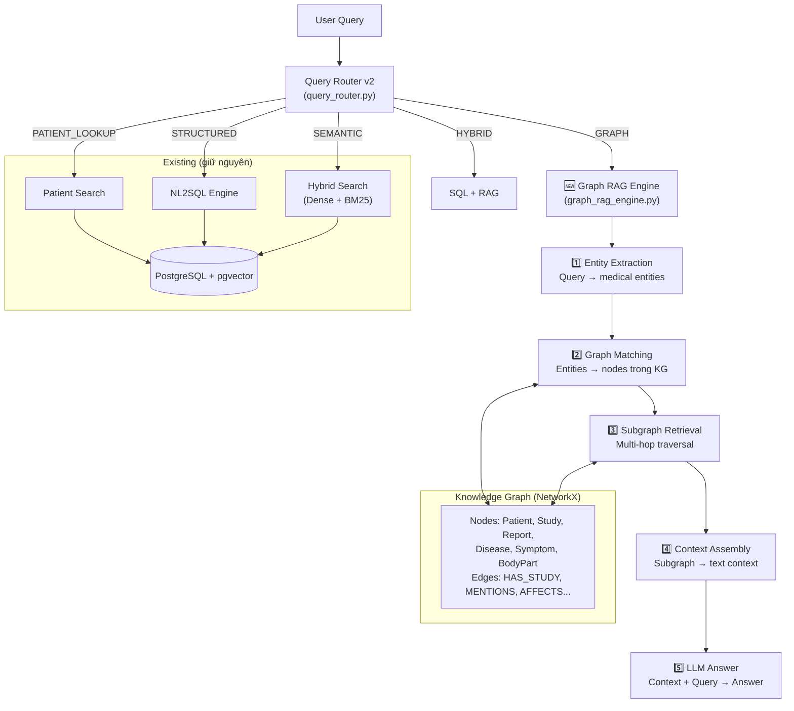

# Graph RAG Pipeline cho PACS++ — Implementation Plan v2

## Mục tiêu

Thêm **Graph RAG** vào hệ thống PACS++ hiện tại để hỗ trợ:
- Câu hỏi **multi-hop** (VD: "bệnh nhân nào chụp CT ≥ 3 lần có tổn thương phổi?")
- **Pattern discovery** (VD: "bệnh lý nào hay đi kèm tràn dịch màng phổi?")
- **Doctor analysis** (VD: "bác sĩ nào có nhiều kinh nghiệm nhất về u phổi?")

**Tech stack**: NetworkX (in-memory graph) + Gemma 4 e4b (Ollama local) + PostgreSQL (data source)

---

## Kiến trúc tổng quan



---

## Proposed Changes

### Component 1: Core Engine

#### [NEW] core/graph_rag_engine.py

File chính ~350 dòng, gồm 3 class:

**Class `MedicalEntityExtractor`:**
- Gọi Ollama `gemma4:e4b` để trích xuất entities y tế từ report text
- Prompt tiếng Việt, output JSON: `{diseases, symptoms, body_parts, severity}`
- Fallback sang Gemini nếu Ollama fail
- Cache kết quả vào `data/medical_entities.json`

```python
class MedicalEntityExtractor:
    MODEL = "gemma4:e4b"  # Local LLM

    def extract(self, findings: str, conclusion: str) -> dict:
        """Extract medical entities from report text via LLM"""
        prompt = f"""Trích xuất thực thể y khoa từ báo cáo chẩn đoán hình ảnh.
Trả về JSON chính xác theo format, KHÔNG giải thích.

Findings: {findings}
Conclusion: {conclusion}

{{"diseases": ["tên bệnh 1", "tên bệnh 2"],
  "symptoms": ["triệu chứng 1", "triệu chứng 2"],
  "body_parts": ["vùng cơ thể 1"],
  "severity": "normal|mild|moderate|severe"}}"""
        # → Ollama API → parse JSON → return
```

**Class `KnowledgeGraph`** (Singleton):
- Dùng `networkx.DiGraph` — directed graph
- `build_from_db()`: load structured data từ PostgreSQL → tạo nodes (Patient, Study, Report, Doctor) + edges
- `enrich_with_entities()`: gọi `MedicalEntityExtractor` cho mỗi report → thêm Disease, Symptom, BodyPart nodes
- `query(question)`: tìm entities trong câu hỏi → match nodes → traverse → return subgraph
- `get_stats()`: đếm nodes/edges theo type

**Node types & properties:**

| Node Type | Properties | Source |
|---|---|---|
| `Patient` | id, name, gender, birth_date | patients table |
| `Study` | id, modality, study_date, description, status | studies table |
| `Report` | id, findings, conclusion, report_date | diagnostic_reports table |
| `Doctor` | id, name | users table (role=doctor) |
| `Disease` | name (normalized) | LLM extraction |
| `Symptom` | name (normalized) | LLM extraction |
| `BodyPart` | name (normalized) | LLM extraction |

**Edge types:**

| Edge | From → To | Created by |
|---|---|---|
| `HAS_STUDY` | Patient → Study | DB relation |
| `HAS_REPORT` | Study → Report | DB relation |
| `AUTHORED` | Doctor → Report | DB relation |
| `USES_MODALITY` | Study → Modality | DB field |
| `MENTIONS_DISEASE` | Report → Disease | LLM extraction |
| `DESCRIBES_SYMPTOM` | Report → Symptom | LLM extraction |
| `EXAMINES_BODYPART` | Report → BodyPart | LLM extraction |
| `INDICATES` | Symptom → Disease | LLM inference |

**Public function `graph_search()`:**

```python
def graph_search(query: str, max_hops: int = 2, top_k: int = 10) -> list:
    """
    1. Extract entities từ query (dùng LLM hoặc keyword matching)
    2. Tìm matching nodes trong graph
    3. Multi-hop traversal (BFS) từ matching nodes
    4. Collect reports trong subgraph
    5. Rank theo relevance (số connections, hop distance)
    6. Return top-K results
    """
```

---

#### [NEW] scripts/build_knowledge_graph.py

Script chạy 1 lần để build Knowledge Graph ban đầu:

```python
"""
Usage: python scripts/build_knowledge_graph.py

Steps:
1. Load all patients, studies, reports, doctors từ PostgreSQL
2. Build structural graph (Patient → Study → Report, Doctor → Report)
3. Extract medical entities cho mỗi report bằng Gemma 4
4. Enrich graph với Disease, Symptom, BodyPart nodes
5. Save entity cache → data/medical_entities.json
6. Print graph statistics
"""
```

Estimated time: ~75 reports × ~3s/report = 3-4 phút (lần đầu)

---

### Component 2: Query Router Integration

#### [MODIFY] core/query_router.py

Thêm `GRAPH` intent vào `INTENT_EXAMPLES`:

```python
INTENT_EXAMPLES = {
    # ... existing STRUCTURED, PATIENT_LOOKUP, SEMANTIC ...
    
    "GRAPH": [
        # Multi-hop queries
        "bệnh nhân nào chụp CT nhiều hơn 2 lần có tổn thương phổi",
        "ai chụp nhiều lần nhất mà lần nào cũng phát hiện bất thường",
        "bệnh nhân nào có diễn tiến từ viêm phổi sang tràn dịch",
        # Pattern / co-occurrence
        "bệnh lý nào thường đi kèm tràn dịch màng phổi",
        "triệu chứng nào hay xuất hiện cùng u phổi",
        "mối liên hệ giữa viêm phổi và xẹp phổi",
        # Doctor analysis
        "bác sĩ nào chẩn đoán u phổi nhiều nhất",
        "bác sĩ nào có kinh nghiệm về tổn thương gan",
        # Temporal / progression
        "lịch sử khám của bệnh nhân X",
        "diễn tiến bệnh qua các lần chụp",
        "bệnh nhân nào tái khám nhiều lần",
    ],
}
```

Cập nhật `classify()` — thêm GRAPH score vào logging:

```python
g_score = intent_scores.get("GRAPH", 0)
logger.info(f"... S={s_score:.2f}, R={r_score:.2f}, P={p_score:.2f}, G={g_score:.2f} ...")
```

---

#### [MODIFY] core/nl2sql_engine.py

Thêm GRAPH branch trong `ask()` function (sau line ~363):

```python
elif intent == "GRAPH":
    from core.graph_rag_engine import graph_search
    graph_results = graph_search(question)
    result['rag_results'] = graph_results['results']
    result['source'] = 'graph_rag'
    result['answer'] = graph_results.get('answer', f"Tìm thấy {len(graph_results['results'])} kết quả từ Knowledge Graph.")
    result['graph_stats'] = graph_results.get('stats', {})
```

---

### Component 3: API Layer

#### [NEW] api/graph.py

```python
router = APIRouter(prefix="/api/graph", tags=["Graph RAG"])

# GET  /api/graph/stats    → Knowledge Graph statistics
# POST /api/graph/search   → Graph-based search
# POST /api/graph/rebuild  → Rebuild graph (admin only)
# GET  /api/graph/entities/{report_id} → Entities của 1 report
```

#### [MODIFY] api/search.py

Thêm `method="graph"` vào `search_reports()`:

```python
elif body.method == "graph":
    from core.graph_rag_engine import graph_search
    graph_result = graph_search(query, top_k=body.top_k)
    results = graph_result['results']
```

#### [MODIFY] main.py

```python
from api import auth, worklist, dicom, report, dicom_editor, admin, search, ask, graph
# ...
app.include_router(graph.router)  # prefix=/api/graph (Graph RAG)
```

---

### Component 4: Config & Dependencies

#### [MODIFY] requirements.txt

```diff
+# Graph RAG
+networkx>=3.2
```

#### [MODIFY] .env

```diff
+# ==================== GRAPH RAG ====================
+GRAPH_ENTITY_CACHE=data/medical_entities.json
+GRAPH_LLM_MODEL=gemma4:e4b
```

#### [NEW] data/ directory

```
backend-v2/
  data/
    medical_entities.json    ← Entity extraction cache (auto-generated)
```

---

## File Summary

| Action | File | Lines (est.) | Mô tả |
|---|---|---|---|
| 🆕 NEW | `core/graph_rag_engine.py` | ~400 | Main engine: extraction + graph + search |
| 🆕 NEW | `scripts/build_knowledge_graph.py` | ~80 | Build script |
| 🆕 NEW | `api/graph.py` | ~80 | API endpoints |
| ✏️ MODIFY | `core/query_router.py` | +15 | GRAPH intent examples |
| ✏️ MODIFY | `core/nl2sql_engine.py` | +10 | GRAPH branch in ask() |
| ✏️ MODIFY | `api/search.py` | +5 | method="graph" |
| ✏️ MODIFY | `main.py` | +2 | Register graph router |
| ✏️ MODIFY | `requirements.txt` | +2 | networkx |
| ✏️ MODIFY | `.env` | +3 | Graph config |

**Total: 3 files mới + 6 files sửa**

---

## User Review Required

> [!IMPORTANT]
> **Entity Extraction lần đầu** sẽ gọi Gemma 4 cho ~75 reports, mất ~3-4 phút. Sau đó cache lại trong `data/medical_entities.json`, không cần gọi lại.

> [!NOTE]
> **Graph tự rebuild** khi server khởi động (nếu có cache). Nếu chưa có cache, cần chạy `python scripts/build_knowledge_graph.py` trước.

> [!WARNING]
> **Entity extraction chất lượng** phụ thuộc vào Gemma 4 e4b. Với báo cáo y tế tiếng Việt, có thể cần tinh chỉnh prompt nếu kết quả chưa tốt.

---

## Verification Plan

### Automated Tests

```bash
# 1. Build Knowledge Graph
python scripts/build_knowledge_graph.py

# 2. Test graph search API
curl -X POST http://localhost:8000/api/graph/search \
  -H "Authorization: Bearer <token>" \
  -d '{"query": "bệnh lý nào đi kèm tràn dịch màng phổi"}'

# 3. Test graph stats
curl http://localhost:8000/api/graph/stats \
  -H "Authorization: Bearer <token>"

# 4. Test integration via /api/ask
curl -X POST http://localhost:8000/api/ask \
  -H "Authorization: Bearer <token>" \
  -d '{"question": "bác sĩ nào chẩn đoán u phổi nhiều nhất"}'
```

### Manual Verification
- Kiểm tra entities extracted từ 5 reports mẫu
- So sánh graph search vs hybrid search cho cùng câu hỏi
- Verify graph stats hợp lý (đúng số patients, studies, reports)
