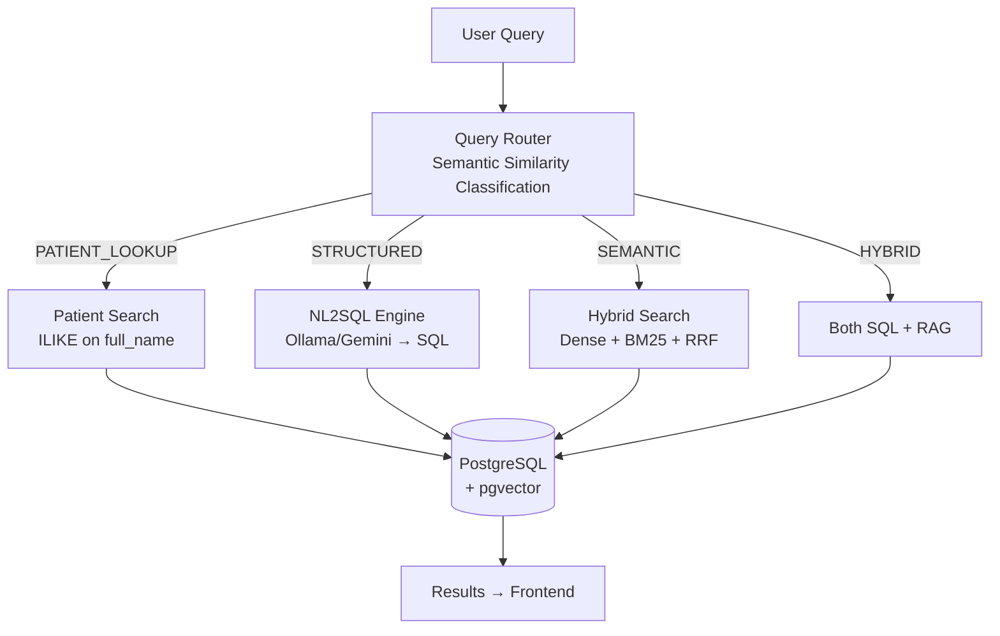
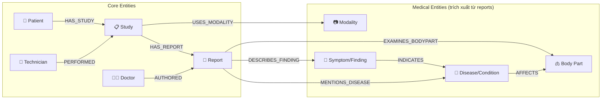
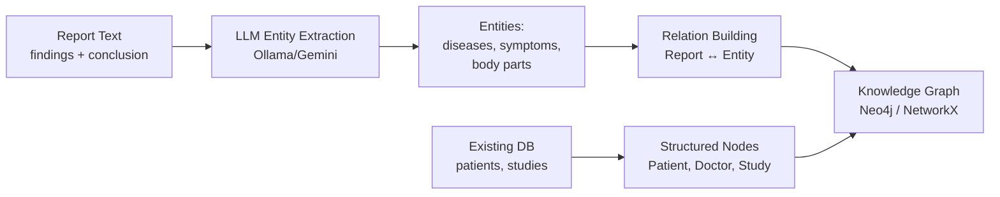
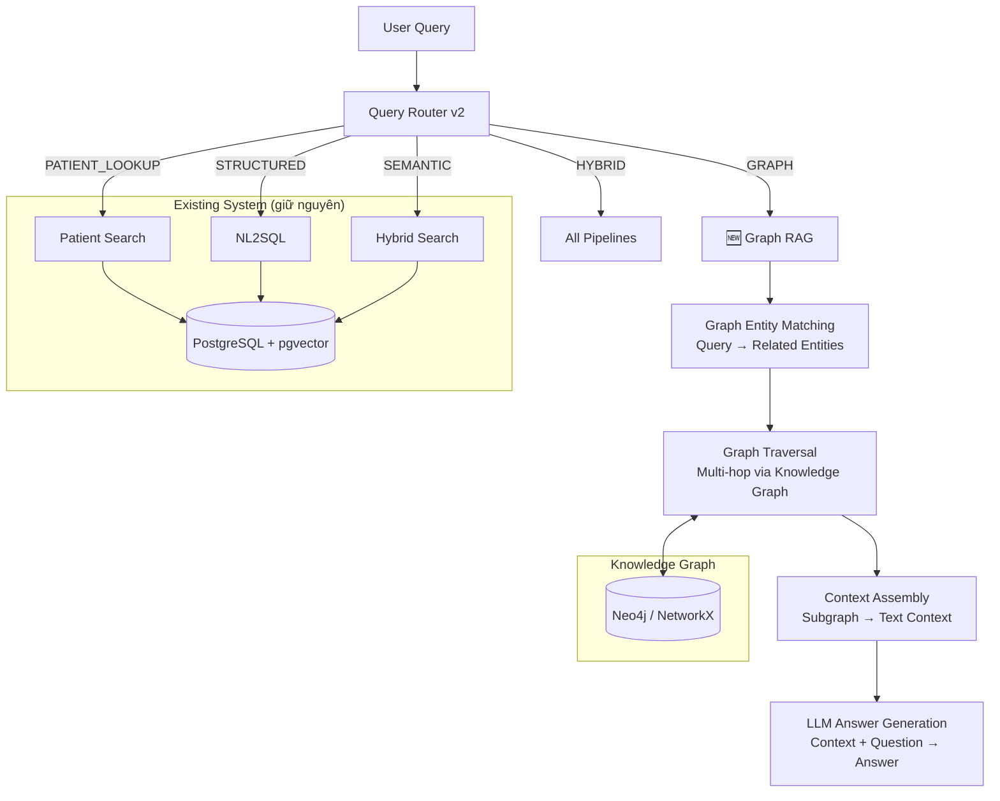

# Phân tích Graph RAG cho hệ thống PACS++

## 1. Kiến trúc RAG hiện tại của PACS++

Hệ thống PACS++ hiện có **4 phương thức tìm kiếm**, được điều phối bởi `query_router.py`:



### Các module chính:

| Module | File | Chức năng |
|---|---|---|
| **Query Router** | [query_router.py](file:///e:/HoangDucLong_javisai/pacs_rag_system/backend-v2/core/query_router.py) | Phân loại intent bằng semantic similarity |
| **RAG Engine** | [rag_engine.py](file:///e:/HoangDucLong_javisai/pacs_rag_system/backend-v2/core/rag_engine.py) | Keyword, Dense, Hybrid search |
| **NL2SQL** | [nl2sql_engine.py](file:///e:/HoangDucLong_javisai/pacs_rag_system/backend-v2/core/nl2sql_engine.py) | Chuyển câu hỏi → SQL bằng LLM |
| **Embeddings** | [embeddings.py](file:///e:/HoangDucLong_javisai/pacs_rag_system/backend-v2/core/embeddings.py) | multilingual-e5-large (1024d) |

### Database Schema (relational):

```
patients ─1:N─► studies ─1:1─► diagnostic_reports
                    │                    │
                    └── technician_id ──►│── doctor_id ──► users
```

---

## 2. Điểm mạnh & điểm yếu của kiến trúc hiện tại

### ✅ Điểm mạnh
- **Hybrid search (Dense + BM25 + RRF)** — state-of-the-art cho text retrieval
- **NL2SQL** — xử lý tốt câu hỏi thống kê, đếm, lọc
- **Intent classification** — tự động route đúng pipeline
- **pgvector** — tìm kiếm vector nhanh, tích hợp sẵn PostgreSQL

### ❌ Điểm yếu (nơi Graph RAG có thể giúp)

| Vấn đề | Ví dụ cụ thể | Tại sao RAG hiện tại yếu? |
|---|---|---|
| **Câu hỏi multi-hop** | "Bệnh nhân nào chụp CT ≥ 3 lần mà lần nào cũng có tổn thương phổi?" | Dense search tìm từng chunk riêng lẻ, không liên kết được thông tin giữa nhiều reports |
| **Quan hệ bác sĩ - bệnh lý** | "BS Trần Nam thường chẩn đoán bệnh gì?" | NL2SQL có thể làm nhưng thiếu aggregation semantic |
| **Tìm pattern bệnh lý** | "Bệnh nhân nào có diễn tiến từ viêm phổi → tràn dịch màng phổi?" | Không thể truy vấn chuỗi sự kiện theo thời gian |
| **Tương quan modality - bệnh** | "Modality nào phát hiện u gan hiệu quả nhất?" | Cần kết hợp structured data + semantic analysis |
| **Network analysis** | "Nhóm bác sĩ nào có tỷ lệ phát hiện bất thường cao nhất?" | Relational DB không tối ưu cho graph queries |

---

## 3. Thiết kế Knowledge Graph cho PACS++

### 3.1 Entity Types (Node types)



### 3.2 Relation Types (Edge types)

| Relation | Source → Target | Ví dụ |
|---|---|---|
| `HAS_STUDY` | Patient → Study | Nguyễn Văn A → CT Chest 2024-01 |
| `HAS_REPORT` | Study → Report | CT Chest → Report #45 |
| `AUTHORED` | Doctor → Report | BS Trần Nam → Report #45 |
| `PERFORMED` | Technician → Study | KTV Lê Hoa → CT Chest |
| `USES_MODALITY` | Study → Modality | CT Chest → CT |
| `MENTIONS_DISEASE` | Report → Disease | Report #45 → Viêm phổi |
| `DESCRIBES_FINDING` | Report → Symptom | Report #45 → Mờ kính rải rác |
| `EXAMINES_BODYPART` | Report → BodyPart | Report #45 → Phổi |
| `INDICATES` | Symptom → Disease | Mờ kính rải rác → Viêm phổi kẽ |
| `AFFECTS` | Disease → BodyPart | Viêm phổi → Phổi |
| `TEMPORAL_NEXT` | Study → Study | CT 2024-01 → CT 2024-06 (cùng BN) |

### 3.3 Entity Extraction Pipeline



**Prompt cho LLM extraction:**
```
Trích xuất các thực thể y khoa từ báo cáo chẩn đoán sau:

Findings: {findings}
Conclusion: {conclusion}

Trả về JSON:
{
  "diseases": ["viêm phổi", "tràn dịch màng phổi"],
  "symptoms": ["mờ kính rải rác", "dịch hai bên"],  
  "body_parts": ["phổi", "màng phổi"],
  "severity": "moderate"
}
```

---

## 4. Kiến trúc Graph RAG đề xuất cho PACS++

### 4.1 Phương án A: Lightweight (NetworkX in-memory)

> [!TIP]
> **Phù hợp nếu**: < 10,000 reports, chạy trên 1 server, không cần persistence riêng

```
Ưu điểm:
  ✅ Không cần thêm infrastructure (không Docker service mới)
  ✅ Dễ tích hợp vào FastAPI hiện tại
  ✅ Graph lưu trong PostgreSQL, load vào RAM khi khởi động

Nhược điểm:
  ❌ Không scale > 100K nodes
  ❌ Không có query language riêng (phải code Python)
  ❌ Mất graph khi restart (phải rebuild)
```

### 4.2 Phương án B: Full Graph DB (Neo4j)

> [!TIP]
> **Phù hợp nếu**: Scale lớn, cần Cypher query language, enterprise-grade

```
Ưu điểm:
  ✅ Cypher query language rất mạnh cho graph traversal
  ✅ Scale tốt (triệu nodes)
  ✅ Neo4j có sẵn vector search (từ v5.11)
  ✅ Visualization tools (Neo4j Browser, Bloom)

Nhược điểm:
  ❌ Thêm 1 Docker service → phức tạp infra
  ❌ Learning curve cho Cypher
  ❌ Cần đồng bộ data giữa PostgreSQL ↔ Neo4j
```

### 4.3 Kiến trúc tích hợp đề xuất



---

## 5. Ví dụ Graph RAG queries cụ thể

### Query 1: Multi-hop (hiện tại KHÔNG làm được)

> **"Bệnh nhân nào chụp CT nhiều hơn 2 lần và có tổn thương phổi?"**

```
Graph Traversal:
  MATCH (p:Patient)-[:HAS_STUDY]->(s:Study)-[:HAS_REPORT]->(r:Report)
        -[:MENTIONS_DISEASE]->(d:Disease)
  WHERE s.modality = 'CT' 
    AND d.name CONTAINS 'phổi'
  WITH p, COUNT(s) AS ct_count
  WHERE ct_count > 2
  RETURN p.full_name, ct_count
```

### Query 2: Pattern Discovery

> **"Bệnh lý nào thường đi kèm với tràn dịch màng phổi?"**

```
Graph Traversal:
  MATCH (d1:Disease {name: 'tràn dịch màng phổi'})<-[:MENTIONS_DISEASE]-(r:Report)
        -[:MENTIONS_DISEASE]->(d2:Disease)
  WHERE d1 <> d2
  RETURN d2.name, COUNT(*) AS co_occurrence
  ORDER BY co_occurrence DESC
```

### Query 3: Doctor Specialization

> **"Bác sĩ nào có kinh nghiệm nhiều nhất về u phổi?"**

```
Graph Traversal:
  MATCH (doc:Doctor)-[:AUTHORED]->(r:Report)-[:MENTIONS_DISEASE]->(d:Disease)
  WHERE d.name CONTAINS 'u phổi'
  RETURN doc.full_name, COUNT(r) AS report_count
  ORDER BY report_count DESC
```

---

## 6. Đánh giá: Có nên áp dụng Graph RAG cho PACS++ không?

### Bảng đánh giá tổng hợp

| Tiêu chí | Score (1-5) | Ghi chú |
|---|---|---|
| **Dữ liệu có quan hệ phức tạp?** | ⭐⭐⭐⭐ | Patient → Study → Report → Disease — rõ ràng graph structure |
| **Cần multi-hop queries?** | ⭐⭐⭐ | Có nhu cầu nhưng chưa phải top priority |
| **Data volume hiện tại** | ⭐⭐ | ~75-100 reports — quá nhỏ để Graph RAG phát huy |
| **Complexity vs. Benefit** | ⭐⭐ | NL2SQL + Hybrid đang cover 80% use cases |
| **Learning value** | ⭐⭐⭐⭐⭐ | Rất tốt cho portfolio AI/ML |
| **Production readiness** | ⭐⭐ | Prototype OK, production cần nhiều effort |

### Kết luận

> [!IMPORTANT]
> ### Kết luận: **NÊN thử nhưng CHƯA cần vội**
>
> **Lý do NÊN thử:**
> - Dữ liệu PACS có cấu trúc graph tự nhiên (Patient → Study → Report → Disease)
> - Sẽ mở ra khả năng query mà RAG truyền thống không làm được (multi-hop, pattern discovery)
> - Rất tốt cho portfolio và learning
>
> **Lý do CHƯA cần vội:**
> - Dataset hiện tại (~75-100 reports) quá nhỏ → không thấy rõ lợi ích
> - NL2SQL + Hybrid search đang hoạt động tốt cho hầu hết use cases
> - Entity extraction từ báo cáo y tế tiếng Việt cần effort lớn (LLM + validation)
> - Thêm Neo4j = thêm complexity cho infrastructure

### Lộ trình đề xuất (nếu muốn làm)

```
Phase 1 (1-2 tuần): Proof of Concept
  ├── Dùng NetworkX (in-memory, không cần Neo4j)
  ├── LLM trích xuất entities từ reports hiện có  
  ├── Build graph đơn giản: Patient → Study → Report → Disease
  └── Thử 5-10 graph queries xem kết quả có tốt không

Phase 2 (2-3 tuần): Tích hợp vào PACS++
  ├── Thêm intent "GRAPH" vào query_router
  ├── Build graph_rag_engine.py
  ├── Frontend: thêm option "Graph Search"
  └── So sánh kết quả Graph vs Hybrid vs NL2SQL

Phase 3 (tùy chọn): Scale
  ├── Migrate sang Neo4j nếu data > 1000 reports
  ├── Thêm community detection (Microsoft GraphRAG pattern)
  └── Auto-update graph khi tạo report mới
```

---

## 7. So sánh chi phí

| Hạng mục | RAG hiện tại | + Graph RAG (NetworkX) | + Graph RAG (Neo4j) |
|---|---|---|---|
| **Infra** | PostgreSQL + Orthanc | Không thêm | + Neo4j Docker |
| **RAM** | ~2GB (e5-large) | + ~200MB (graph) | + 1GB (Neo4j) |
| **Disk** | ~5GB | + ~50MB | + ~500MB |
| **Dev effort** | Đã xong | 1-2 tuần | 3-4 tuần |
| **Dependencies** | pgvector, sentence-transformers | + networkx | + neo4j-driver, py2neo |
| **Indexing time** | ~5s/report (embedding) | + ~3s/report (entity extraction) | + ~5s/report |
