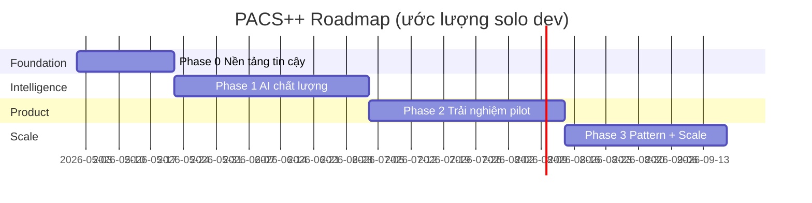
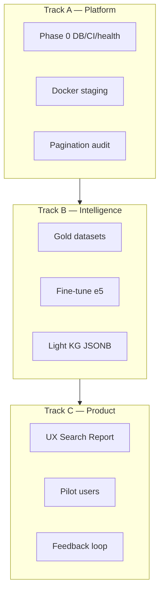

# PACS++ — Roadmap phát triển (v2)

> **Mục tiêu:** Đưa project từ **POC đồ án** → **nền tảng RAG y khoa tiếng Việt có thể demo, pilot và mở rộng dần**.  
> **Không** nhắm thay PACS thương mại ngay; **có** nhắm trở thành lớp “trí tuệ tra cứu + workflow mini” gắn DICOM.

**Liên quan:**
- Vấn đề & sửa lỗi: [ISSUES_AND_FIX_PLAN.md](./ISSUES_AND_FIX_PLAN.md)
- Sprint lịch sử: [05_sprint_roadmap.md](./05_sprint_roadmap.md)
- ~~Graph RAG~~ → **đã loại khỏi roadmap** (xem §3.4). Tài liệu cũ giữ ở [09_graph_rag_plan.md](./09_graph_rag_plan.md) chỉ để tham khảo, không cam kết build.

**Cập nhật:** 2026-05-19

---

## 1. Định vị & North Star

### 1.1 Một câu định vị

> **PACS++ = Hệ thống quản lý ca chụp DICOM + tra cứu báo cáo chẩn đoán bằng tiếng Việt (SQL + RAG + đồ thị y khoa).**

### 1.2 North Star Metrics (đo được)

| Metric | Hiện tại (~) | Mục tiêu 6 tháng | Mục tiêu 12 tháng |
|--------|--------------|-------------------|-------------------|
| Báo cáo có embedding | 75 | 500+ | 2.000+ |
| Độ chính xác intent router | chưa đo | ≥ 90% trên 100 câu test | ≥ 95% |
| RAG nDCG@10 (benchmark nội bộ) | ~0.90 (e5) | +5% sau fine-tune | +10% |
| Thời gian hybrid search (p95) | < 2s (75 doc) | < 3s (500 doc) | < 5s (2k doc) |
| Uptime demo stack | thủ công | 1-click `docker compose` | CI deploy staging |
| Người dùng pilot | 0 | 3–5 bác sĩ/KTV nội bộ | 1 khoa / lab |

### 1.3 Anti-goals (không làm giai đoạn 1–2)

- Không build HL7/FHIR đầy đủ trước khi RAG ổn.
- Không multi-tenant / billing.
- Không thay Orthanc bằng storage tự viết.
- Không hứa chứng nhận y tế (ISO 13485…) trong roadmap 12 tháng solo.

---

## 2. Hiện trạng (baseline)

```
✅ Sprint 0–4: Infra, Backend, Frontend 8 trang, RAG hybrid, NL2SQL, Query router
❌ Graph RAG: ĐÃ LOẠI khỏi roadmap (lý do: corpus 75 báo cáo chưa đủ, chi phí cao,
              SQL + Light KG JSONB phủ ~80% use case mà chỉ tốn 20% công sức)
⚠️ Nợ kỹ thuật: doc BGE vs e5, DB layer trùng, test hỏng, role API search, scale BM25
```

**Tài sản quan trọng đã có (đừng vứt):**
- Cornerstone3D viewer + WADO proxy
- `query_router` + `vocab.json` (domain VN)
- NL2SQL validator + schema động
- Pipeline seed / bulk DICOM / embed scripts

---

## 3. Cấu trúc roadmap — 4 giai đoạn



| Phase | Thời gian | Tên | Kết quả chính |
|-------|-----------|-----|----------------|
| **0** | 2–3 tuần | Nền tảng tin cậy | Test xanh, bảo mật API, doc đúng, CI |
| **1** | 4–6 tuần | AI chất lượng | Data lớn hơn, fine-tune e5, benchmark, router đo được |
| **2** | 4–6 tuần | Pilot nội bộ | UX bác sĩ, audit, health, feedback loop |
| **3** | 4–5 tuần | Pattern queries + Scale | Light KG (JSONB entities), FTS, index tune, perf |

*Tổng ~3.5–5 tháng part-time; ~2 tháng full-time.*

---

## Phase 0 — Nền tảng tin cậy (BẮT BUỘC)

> **Mục tiêu:** Mọi thứ build sau này đứng trên nền **không vỡ, không lệch doc**.

### 0.1 Deliverables

| ID | Việc | Output |
|----|------|--------|
| 0.1 | Gộp `database/base.py` + `connection.py` | 1 engine SQLAlchemy, 1 pool psycopg2 |
| 0.2 | Sửa `test_query_router.py` + thêm test `classify()` | `pytest tests/` pass |
| 0.3 | `require_roles(admin, doctor)` trên `/api/search`, `/api/ask` | 403 cho technician |
| 0.4 | Đồng bộ doc → **e5-large**; ghi source of truth trong README | Không còn BGE-M3 gây hiểu nhầm |
| 0.5 | `requirements-dev.txt` + GitHub Actions pytest | Badge CI (optional) |
| 0.6 | `.env.example` + compose dùng env | Không password hardcode |
| 0.7 | `/health` check DB + Orthanc | JSON `checks` |

### 0.2 Definition of Done

- [ ] `docker compose up` + `pytest` → green
- [ ] README “Quick start” chạy được từ máy sạch (checklist 1 người mới)
- [ ] [ISSUES_AND_FIX_PLAN.md](./ISSUES_AND_FIX_PLAN.md) mục P0 đánh dấu xong

### 0.3 Ước lượng: **40–60 giờ**

---

## Phase 1 — AI chất lượng & dữ liệu

> **Mục tiêu:** RAG **đo được**, **cải thiện được**, không chỉ “chạy được”.

### 1.1 Data strategy

| Nguồn | Mục đích | Hành động |
|--------|----------|-----------|
| `seed_reports.py` / ViX-Ray | Mở rộng corpus text | Target 300–500 báo cáo gắn study |
| Báo cáo bác sĩ nhập thật (pilot) | Chất lượng domain | Form report + auto-embed (đã có) |
| `vietnamese-medical-qa` | Fine-tune e5 | `embedding_finetuning` đổi sang e5 |
| Benchmark 75→500 queries | Đo regression | File `tests/data/search_gold.jsonl` |

**Quy tắc dữ liệu:**
1. Mỗi `diagnostic_reports` phải có `study_id` hợp lệ.
2. Sau mỗi batch import → `embed_existing.py` + `ensure_vector_index.py`.
3. Không mix model embedding trong cùng bảng (re-embed all khi đổi model).

### 1.2 Deliverables

| ID | Việc | Output |
|----|------|--------|
| 1.1 | Bộ **100 câu hỏi vàng** + intent + expected path | `tests/data/router_gold.jsonl` |
| 1.2 | Bộ **50 câu RAG** + relevant report_ids | `tests/data/rag_gold.jsonl` |
| 1.3 | Script `benchmark_search.py` chuẩn hóa | CSV: P@5, nDCG@10, latency |
| 1.4 | Fine-tune e5 trên Kaggle/local | Model trong `embedding_finetuning/models/` |
| 1.5 | Tích hợp model fine-tune vào `EmbeddingModel` (env flag) | `EMBEDDING_MODEL_PATH` |
| 1.6 | BM25 cache invalidate khi CREATE/UPDATE report | Không full reload mỗi request |
| 1.7 | `config`: Ollama URL + model từ `.env` | Không hardcode |

### 1.3 Cải thiện router (đo trước, sửa sau)

```
Tuần 1: Ghi lại 100 câu → classify() → so intent mong đợi → accuracy %
Tuần 2: Sửa vocab.json + weights (W_*) cho case fail
Tuần 3: (Optional) thêm embedding reranker cho HYBRID borderline — chỉ nếu rule < 85%
```

**Không** thay rule engine bằng LLM classifier ngay — tốn latency + khó debug.

### 1.4 Definition of Done

- [ ] Router accuracy ≥ 90% trên gold set
- [ ] Benchmark trước/sau fine-tune có báo cáo markdown
- [ ] Hybrid search p95 < 3s với 500 reports (máy dev 1 GPU hoặc CPU)

### 1.5 Ước lượng: **80–120 giờ**

---

## Phase 2 — Sản phẩm pilot nội bộ

> **Mục tiêu:** 3–5 người dùng thật (bác sĩ/KTV) dùng **1–2 tuần** và cho feedback.

### 2.1 Trải nghiệm bác sĩ (UX)

| ID | Việc | Lý do |
|----|------|-------|
| 2.1 | Search: hiển thị **giải thích intent** + “tại sao kết quả này” | Tin cậy AI |
| 2.2 | `generate_answer` v2: template giàu hơn hoặc LLM summarize ngắn | Không chỉ “Tìm thấy N báo cáo” |
| 2.3 | Lịch sử câu hỏi gần đây (localStorage hoặc DB) | Tiện tra cứu lại |
| 2.4 | Report: autosave draft | Giảm mất báo cáo |
| 2.5 | Worklist: pagination + search tên BN | > 75 ca |
| 2.6 | Onboarding 1 trang “Hướng dẫn nhanh” | Giảm hỏi |

### 2.2 Bảo mật & compliance tối thiểu (pilot)

| ID | Việc |
|----|------|
| 2.7 | WADO: check quyền study trước stream |
| 2.8 | Audit: log REPORT_CREATE, DICOM_UPLOAD, SEARCH (hash query) |
| 2.9 | Patient password: bắt đổi mật khẩu lần đầu (đơn giản) |
| 2.10 | Không log JWT / không commit `.env` |

### 2.3 Vận hành

| ID | Việc |
|----|------|
| 2.11 | `docker compose` profile: `dev` / `demo` |
| 2.12 | Script `scripts/backup_db.sh` |
| 2.13 | Staging deploy (1 VPS hoặc Railway): FE build + API |

### 2.4 Pilot playbook

1. **Tuần 1:** KTV upload 20 ca mới; bác sĩ viết 20 báo cáo.
2. **Tuần 2:** Bác sĩ chỉ dùng Search (không ILIKE worklist) — ghi 10 câu hỏi fail.
3. **Tuần 3:** Fix top 5 pain points; đo lại router/RAG gold set.

**Deliverable:** `docs/PILOT_FEEDBACK.md` (template có sẵn trong repo sau pilot).

### 2.5 Definition of Done

- [ ] ≥ 3 user hoàn thành workflow upload → report → search
- [ ] Không lỗi 500 blocker trong 1 tuần pilot
- [ ] WADO không lộ ảnh chéo bệnh nhân (test case viết sẵn)

### 2.6 Ước lượng: **60–100 giờ**

---

## Phase 3 — Pattern queries & Scale

> **Mục tiêu:** Trả lời câu hỏi **multi-hop / pattern** mà NL2SQL hiện tại fail — **bằng cách rẻ nhất** (không Graph RAG).
> **Nguyên tắc:** SQL trước, JSONB sau, vector cuối, **không** NetworkX/Neo4j giai đoạn này.

### 3.1 Light KG — Entity tags trong JSONB (thay Graph RAG)

**Ý tưởng:** Trích entity y khoa **1 lần** lúc lưu báo cáo → lưu vào cột `JSONB` → query bằng SQL thuần. Phủ ~80% câu pattern mà chỉ tốn ~20% công sức Graph RAG.

**Schema:**

```sql
ALTER TABLE diagnostic_reports
  ADD COLUMN entities JSONB;       -- {diseases:[], anatomy:[], severity:""}
CREATE INDEX idx_reports_entities
  ON diagnostic_reports USING GIN (entities);
```

**Pipeline:**

```
POST /api/report
  → save findings/conclusion
  → embed (đã có)
  → extract_entities() qua Ollama gemma → JSONB
  → UPDATE entities
```

**Query mẫu (SQL thuần):**

```sql
-- "Bệnh hay đi kèm tràn dịch?"
SELECT jsonb_array_elements_text(entities->'diseases') AS d, COUNT(*)
FROM diagnostic_reports
WHERE entities->'diseases' ? 'tràn dịch'
GROUP BY d ORDER BY 2 DESC LIMIT 10;
```

### 3.2 Deliverables

| ID | Việc | Output |
|----|------|--------|
| 3.1 | `core/entity_extractor.py` (Ollama prompt VN) | JSONB schema chuẩn |
| 3.2 | Migration `entities` column + GIN index | `init_db.sql` |
| 3.3 | Backfill script entities cho 500 báo cáo | `scripts/extract_entities.py` |
| 3.4 | NL2SQL prompt bổ sung schema entities + ví dụ JSONB | `nl2sql_engine.py` |
| 3.5 | Gold set 20 câu pattern + benchmark | `tests/data/pattern_gold.jsonl` |

### 3.3 Scale kỹ thuật

| ID | Việc | Khi nào |
|----|------|---------|
| 3.6 | IVFFlat/HNSW tune `lists` | > 500 vectors |
| 3.7 | PostgreSQL FTS (`tsvector`) thay BM25 in-memory | > 2.000 reports |
| 3.8 | Background worker embed/entity (RQ hoặc cron) | Upload hàng loạt |
| 3.9 | API pagination chuẩn | worklist, search results |

### 3.4 Graph RAG thật sự — **chỉ làm khi**

Cả 3 điều kiện đúng (review sau Phase 2):

1. Pilot log có ≥ 20% câu hỏi **thật sự multi-hop** mà NL2SQL + JSONB fail.
2. Corpus ≥ 1.000 báo cáo có entity chất lượng.
3. Có người maintain entity schema + chi phí LLM ổn định.

Nếu không đủ → **không làm**. Đây là quyết định product, không phải nợ kỹ thuật.

### 3.5 Definition of Done

- [ ] ≥ 15/20 câu pattern gold trả lời đúng bằng NL2SQL + JSONB
- [ ] Hybrid p95 < 5s với 2.000 reports
- [ ] Tài liệu `docs/PATTERN_QUERIES.md` có ví dụ SQL/JSONB

### 3.6 Ước lượng: **50–70 giờ** (giảm ~50% so với Graph RAG)

---

## 4. Ba track song song (cách chia việc)

Nếu làm một mình, **luân phiên theo tuần**, không nhảy lung tung:



**Quy tắc:** Không mở Phase 3 khi Phase 0 chưa xong. Không fine-tune khi chưa có gold set đo.

---

## 5. Lịch gợi ý 12 tuần (part-time ~15h/tuần)

| Tuần | Focus | Milestone |
|------|-------|-----------|
| 1–2 | Phase 0 | pytest green, role API, health |
| 3 | Phase 0 + data | doc e5, 200 reports seed |
| 4–5 | Phase 1 | gold sets + benchmark baseline |
| 6–7 | Phase 1 | fine-tune e5 + BM25 cache |
| 8–9 | Phase 2 | UX search/report + WADO auth |
| 10 | Phase 2 | pilot week 1 |
| 11 | Phase 2 | fix feedback + pilot week 2 |
| 12+ | Phase 3 | Light KG JSONB + FTS + perf |

---

## 6. Công nghệ giữ / thêm / tránh

| Giữ | Thêm (khi cần) | Tránh |
|-----|----------------|-------|
| FastAPI, Postgres, pgvector | `pytest`, GitHub Actions | Kubernetes |
| Orthanc | Redis (cache BM25) — optional | Tự viết DICOM server |
| e5-large (+ fine-tune) | RQ/Celery embed job | Đổi sang vector DB cloud sớm |
| Cornerstone3D | JSONB entities + GIN index | **NetworkX / Neo4j / Graph RAG** |
| Ollama NL2SQL | PostgreSQL FTS (`tsvector`) | LLM cho mọi intent classify |
| | | Microservices tách 5 service |

---

## 7. Tài liệu cần tạo/cập nhật theo phase

| Phase | File |
|-------|------|
| 0 | Cập nhật README, `.env.example`, ISSUES checklist |
| 1 | `docs/BENCHMARK_REPORT.md`, `tests/data/*.jsonl` |
| 2 | `docs/PILOT_FEEDBACK.md`, `docs/DEPLOY_STAGING.md` |
| 3 | `docs/PATTERN_QUERIES.md` (ví dụ JSONB), `docs/ARCHITECTURE_v3.md` |
| — | Cập nhật `09_graph_rag_plan.md` header: **"Deferred — không trong roadmap hiện tại"** |

---

## 8. Rủi ro & giảm thiểu

| Rủi ro | Giảm thiểu |
|--------|------------|
| Ollama không chạy trên máy pilot | Gemini fallback + banner “AI offline” |
| Fine-tune không cải thiện metric | Giữ e5 gốc; chỉ ship model nếu benchmark ↑ |
| Scope creep PACS đầy đủ | Anti-goals §1.3; review mỗi 2 tuần |
| Một người burnout | Phase 0 tối đa 3 tuần; celebrate milestone nhỏ |
| Dữ liệu y tế nhạy cảm | Pilot chỉ synthetic/de-id; audit log |

---

## 9. Vision 12 tháng (nếu roadmap chạy đủ)

```
Tháng 1–2:  Nền tin cậy + benchmark
Tháng 3–4:  Corpus 500+ + fine-tuned e5 + pilot nội bộ
Tháng 5–6:  Light KG JSONB + FTS + staging public demo
Tháng 7–12: Paper/blog kỹ thuật, đối tác lab, tích hợp read-only với PACS có sẵn (export DICOM)
            Đánh giá lại Graph RAG dựa trên pilot log — chỉ làm nếu có evidence
```

**Project lúc đó trông như:**
- Repo **reference implementation** "RAG on Vietnamese radiology reports"
- Demo video 5 phút: upload → report → 4 loại câu hỏi (tên BN / thống kê / bệnh lý / pattern JSONB)
- Có số liệu benchmark, không chỉ claim
- Stack gọn: Postgres + pgvector + Ollama — không phải zoo công nghệ

---

## 10. Bước tiếp theo tuần này (actionable)

1. Đọc [ISSUES_AND_FIX_PLAN.md](./ISSUES_AND_FIX_PLAN.md) — làm **P0** trước.
2. Tạo branch `phase-0-foundation`.
3. Commit checklist:
   - [ ] pytest pass
   - [ ] role search API
   - [ ] README embedding = e5-large
4. Tạo file `tests/data/router_gold.jsonl` với 20 câu đầu tiên (copy từ câu bác sĩ hay hỏi).

---

*Nếu bạn chốt mục tiêu 6 tháng (đồ án / JAVIS product / paper), có thể rút gọn roadmap — chỉ cần nói rõ hướng đó.*
